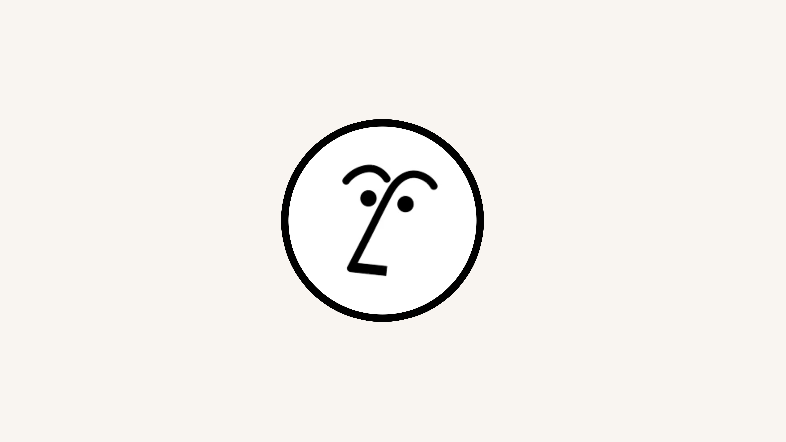
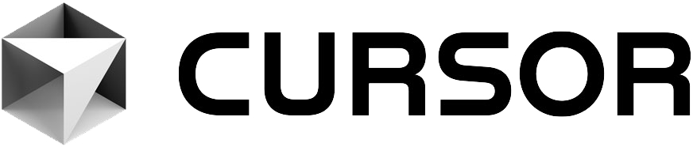
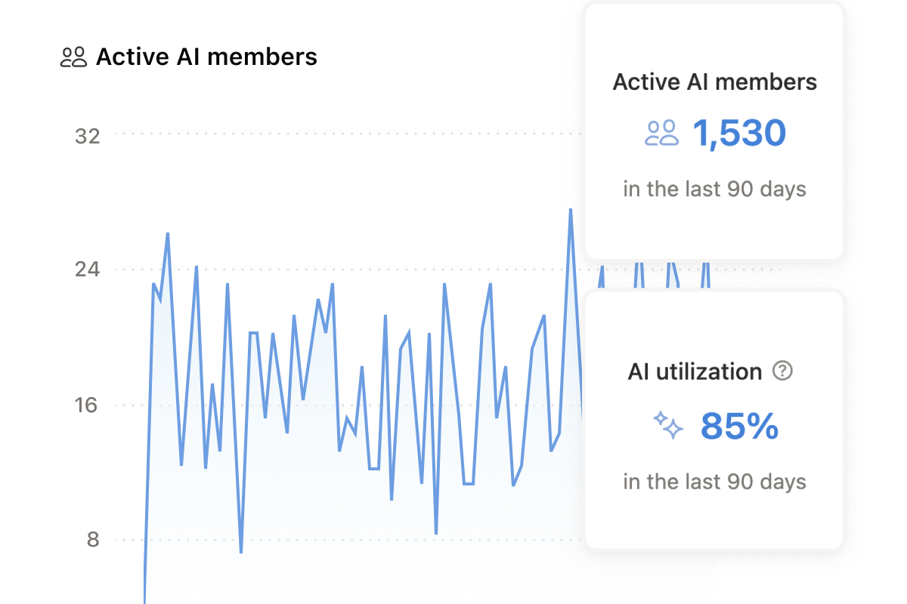

# 🚀 Introducing Notion 3.0: The Connected Workspace

We've re-engineered everything you love. Giving you more control, more power, and unprecedented clarity in one unified workspace.

## What's New?

> "The all-in-one workspace for your life's work, now built with AI at its core."
> — Ivan Zhao, Co-Founder

### ✨ Meet Notion AI: Your Ultimate Thinking Partner
Draft updates, summarize meeting notes, and find exactly what you're looking for... instantly. Built right into where you already work.

### 🗂️ Advanced Databases & Roadmaps
Build the workflow your team actually needs. From engineering roadmaps to company wikis, our new database engine handles millions of rows effortlessly.

### 🎨 Refined Blocks & Design
We introduced a fresh paint job, slicker drag-and-drop, and dozens of new block types to customize your pages.

---

### Ready to elevate your work?
[Get Started for Free](https://notion.so)
