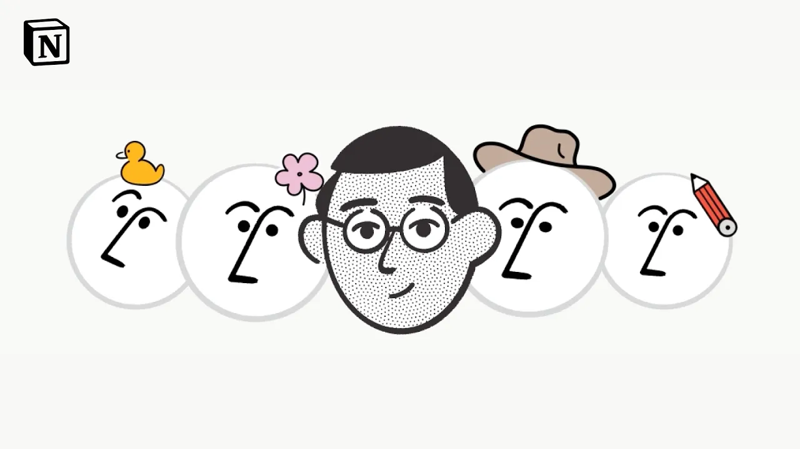
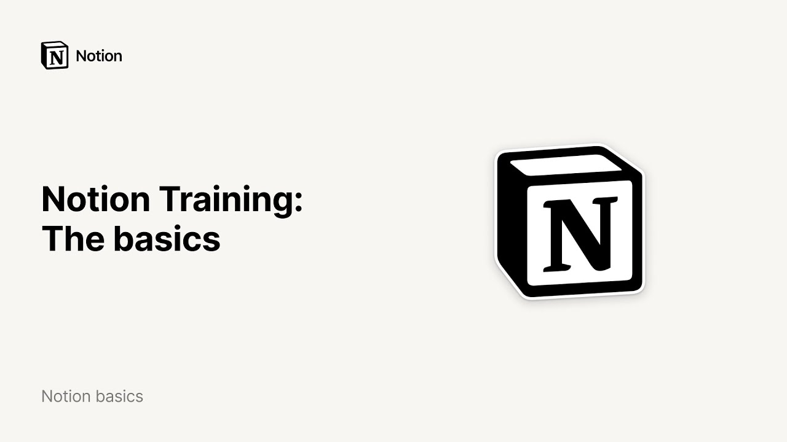
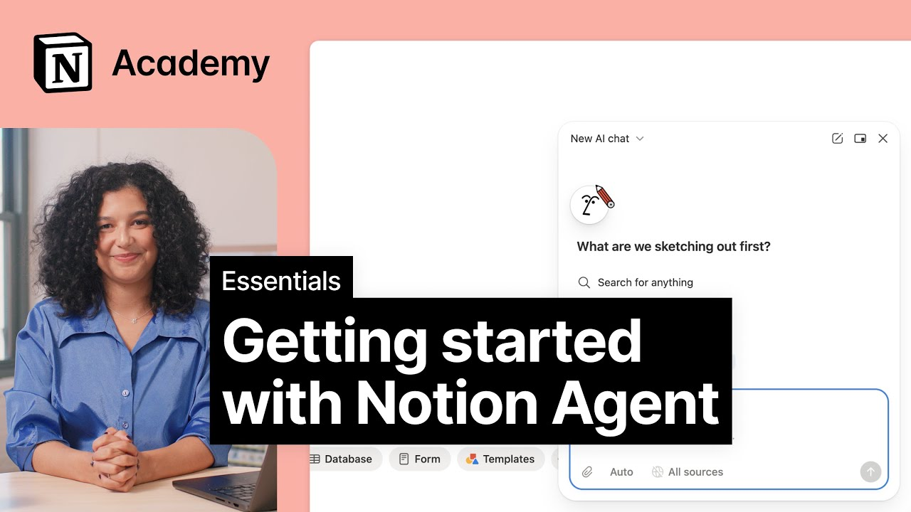

# Notion YouTube Videos

Here are a collection of trailers, tutorials, and intro videos from the official Notion channel:

## [What is Notion?](https://www.youtube.com/watch?v=oTahLEX3NXo)

## [Introducing the new Notion AI](https://www.youtube.com/watch?v=S92KX8-Hmlc)

## [Introducing Notion 3.0: Agents](https://www.youtube.com/watch?v=R1cF4T4lgI4)

## [Notion Training: The Basics](https://www.youtube.com/watch?v=aA7si7AmPkY)

## [Notion 101: Introduction and everything you’ll learn in this course](https://www.youtube.com/watch?v=vdEGOwvxKBo)

## [Getting started with Notion AI](https://www.youtube.com/watch?v=Y5FvtQomPh8)

## [Introduction to databases](https://www.youtube.com/watch?v=npaNKlAO7g8)

## [Getting started with Notion Agent](https://www.youtube.com/watch?v=yasGTeAsV6s)

