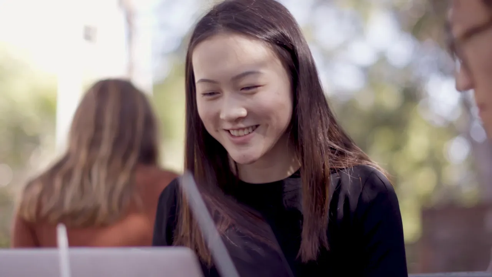

# 🎓Notion is free for students & teachers

**URL:** [https://www.youtube.com/watch?v=qH3iRlZQ_xo](https://www.youtube.com/watch?v=qH3iRlZQ_xo)
**Date:** 2019-09-17

## Transcript

**[Voiceover]**

"[Music] at Berkeley I think that it's really easy to kind of get swept up into the chaos I procrastinate a lot and so I find it hard to kind of stay organized I personally have used so many task managers and productivity tools I've tried everything in college it's not just about your classroom environments but it's also about your"

"personal development my mind is always pretty scattered in like different places even though I want to be 100 percent there notion is a one tool that I've just continued using over time at first glance it's so simple you are inside of a document it's very focused and it just says like right but you can start creating all of"

"these tools around the stuff that you're working on it feels more like a webpage in that way which is really nice notion helps me approach my everyday in a very organized way and also a very intentional way I can be very productive but also switch to a different tab and reflect and have like all my notes there as"

"well there's sort of this narrative technology displaces people I'm kind of interested in exploring how we can reverse that narrative blueprint is a club that uses technology for social good we work with on profits to build them apps or websites that fit their needs as the vice-president I feel like an octopus sometimes I have my hands and all"

"these different types of work efforts to be able to assign tasks and tag people in them or it's at deadlines that are all visible if it's really important to me and it's helped me stay really organized we started keeping track of things in the decision log we linked all of the places that we talked about these things and"

"then we write context for the decision and also what went well and what didn't go as well I saw how productive it was for our entire club to be on notion and I started adopting it more into like my personal life I created a dashboard for most of what I'm working on this summer I kind of had like"

"a school dream section which are like things that I want to involve myself with at Berkeley actually like share a lot of my documents with my sister too we have a shared workspace with all our recipes if you're a student and you have all these different work efforts that you're a part of notion is a really great way"

"to kind of keep them all in one place and then also keep yourself reminded and accountable for the things that you're working on I really want to invest more in the clubs that I'm in and the people that I've runs with the notion is really conducive to that and that's what I've most about it [Music]"

