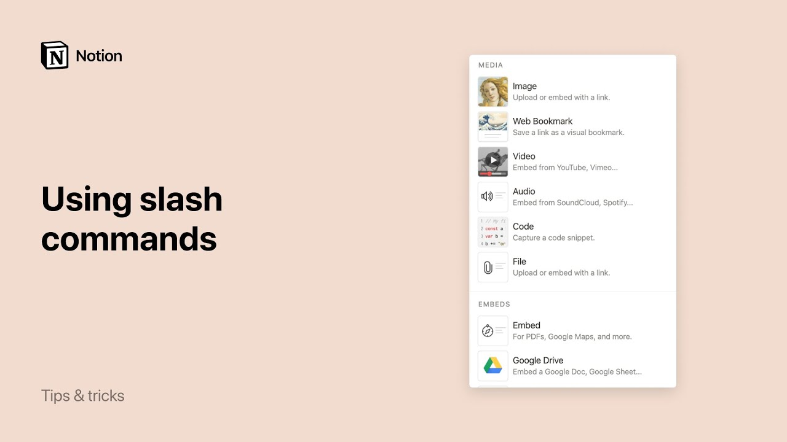

# Using slash commands

**URL:** [https://www.youtube.com/watch?v=cBdyHp_XVFQ](https://www.youtube.com/watch?v=cBdyHp_XVFQ)
**Date:** 2019-12-06

## Transcript

**[Voiceover]**

"let's talk about slash commands in notion you can hit the forward slash key to instantly bring up a menu of content you can add to your page we call these slash commands in this video I'll show you how to use them to build your page any way you want slash commands allow you to quickly create new content on"

"your page modify existing content or take an action on a piece of content like deleting it or duplicating it let's say you wanted to add an image to this page when you hit the slash button on your keyboard you'll see a drop down menu listing all the types of content you can add to your page you can click"

"on the type of content you want to add in or type out the name of the content like bullet or to do and press Enter in this case we'll type slash image once you're familiar with the main content types this makes adding anything you want really fast here are some more examples you can type slash quote to add"

"a breakout quote on your page slash call-out to draw attention to something or slash web to add a web bookmark you can also add advanced content like an inline calendar or a math equation you to modify existing content with a slash command type slash at the end of some text for example slash read to turn the text read"

"or slash yellow background to highlight to change the type of content use slash turn commands such as turn bullet or turn toggle notion lets you transform any one type of content into another one that easily you can also use slash commands to take an action on content for example you can type slash comment at the end of this"

"paragraph to leave a comment on it or slash duplicate to make an exact copy for even more shortcuts click the question mark at the bottom right of your notion window and select keyboard shortcuts [Music]"

