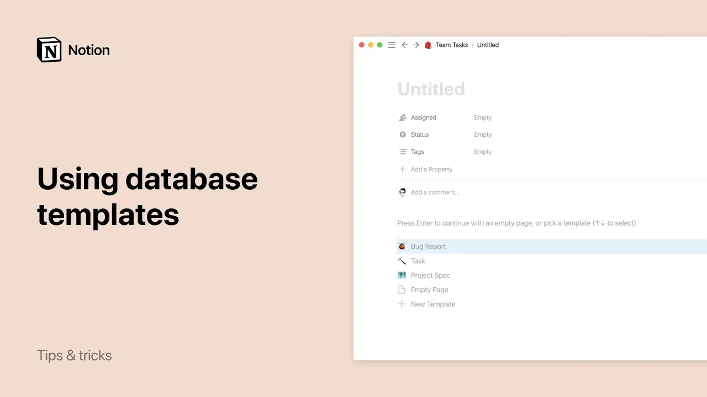

# Using database templates

**URL:** [https://www.youtube.com/watch?v=gMFaeZGGxsk](https://www.youtube.com/watch?v=gMFaeZGGxsk)
**Date:** 2020-01-07

## Transcript

**[Voiceover]**

"do you find yourself adding the same types of content to your databases add some structure and speed up your workflow with database templates as notion becomes more integrated into your day-to-day work you may find yourself repeating the same content over and over again for example if you're in an engineering team you might file a bunch of bug reports"

"and want each of them to include the same prompts in structure database templates help you to save time by automating this process so you don't have to type out the structure for each new database entry you can simply go to this drop-down and select that template to create a new page with the bug report format already filled out"

"I'll delete this one and show you how to make your own template from scratch first click the down arrow next to the blue new button at the top right of your database and select new template at the top of the pop-up that appears you should see this message that indicates that you're editing a template let's give our template"

"a title and add the desired structure in the body of the page this is a great way to remind teammates what information the engineering team needs for each bug report you can also fill out any property values that you'd like to be automatically applied anytime you use this template for this one we'll assign our engineer quarry and add"

"the tags bug and engineering let's add an icon to bug reports don't have to be boring click anywhere outside the pop-up to exit now whenever you want to add a new bug report you can select your template from the drop-down and the structure and properties will already be applied you can edit duplicate or delete your template by clicking"

"the three dots next to the templates name in the drop down if you or someone from your team doesn't use the drop-down when making a new page you can still turn an empty page into your desired template by clicking it in this menu on any new page you create one more example for teams in a meeting notes database"

"you can create a template for your one-on-one meetings with your manager or your employees that way each meeting has a clearly defined structure for status updates questions and feedback database templates can be helpful in your personal life to try adding a template to your journal database so that you give yourself the same prompts to reflect on everyday now"

"you can spend less time on data entry and formatting and more time being productive [Music]"

