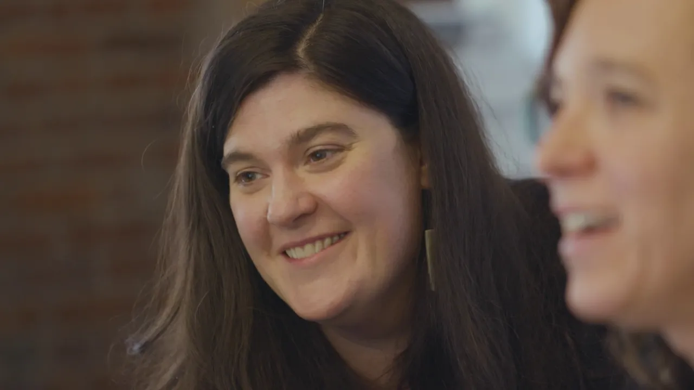

# Figma x Notion: One knowledge base keeps everyone informed & aligned

**URL:** [https://www.youtube.com/watch?v=RJvD_VBz8s4](https://www.youtube.com/watch?v=RJvD_VBz8s4)
**Date:** 2020-01-21

## Transcript

**[Voiceover]**

"[Music] when I started here at figma I was started as a team of one it was the Wild West there was a bunch of tribal knowledge nobody knew where to go to get anything we first started using notion for onboarding our new team hires I show the new employees are employed handbook which we call the thick manual I"

"start with Quick Links to like our lunch menu as well as benefits information a otter cam going on there if people are feeling stressed out at Sigma we are a tool that allows people to come in and to collaborate my job here is to really make us live and breathe this idea of collaboration notion helps me do that"

"on the office operation side or the HR side there's actually a lot of overlap when it comes to onboarding I want to be able to point to the same place so that we don't have multiple versions of it and if I then change my mind if I get additional information links that I have to content don't break and"

"that to me is key I currently manage a dozen people on our support team people can sort of bring their own unique personalities to the documents that they're putting together and then we can actually nest them inside each other and create sort of a directory which became our support team knowledgebase the ease of use of notion I think"

"is one of its real hallmarks it actually helps you visually navigate the content and remember where something is and so we have a bit of a running joke here you know we all try to actually get the most perfect emoji for the different pieces I love that if you are an editor on the page you can just dive"

"right in and get working on the document as more people join they ask more specific questions and if we just constantly add to the fig manual the tool can so easily grow with us it's not something with to rebuild every year since your team is growing and changing and evolving ocean will change with you"

