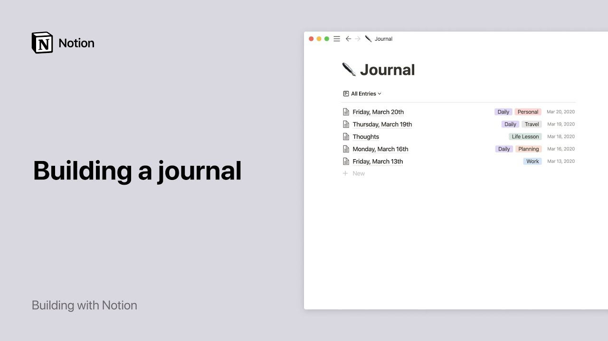

# Build a journal in Notion

**URL:** [https://www.youtube.com/watch?v=sFYPk_8veUQ](https://www.youtube.com/watch?v=sFYPk_8veUQ)
**Date:** 2020-04-03

## Transcript

**[Voiceover]**

"do you write a journal want to start one or make it a habit in this video I'll show you how to use notion to make journaling part of your life it's easy to add text images or even videos and neatly store all of your entries together for future reading and review here's what your notion journal could look like"

"all of the entries are neatly listed sorted newest to oldest and can even be dated and tagged you can click on any entry to view its content I'll show you how to get to this as well as how to quickly add new journal entries first I'll click on the new page button at the bottom of the sidebar and"

"create a new page called journal then I'll add an icon to this page to make it easier to find when I need it this drop down menu at the top lets you specify where you want your new page to be added let's choose private pages so that it goes into the private section of the sidebar which is for"

"your eyes only great now you can find it here we'll nest all of our journal entries inside this top-level page these are already existing journal entries which I would like to move into my journal page to do this I can grab any entry then drag and drop it anywhere inside the page I can also use drag and drop"

"to rearrange entries however I want and of course I can click any entry to see what I've written as an example here's a journal entry from the diary of Anna in you can add more complex types of content to your entries like photos quotes and songs just drag and drop any image into your page hit ford slash quote"

"to bring up the quote option you can even embed a song or album from Spotify that's the simplest way to create a journal in notion but there's also a way which I'll show you to build something a bit more robust using a list database like this one the beauty of the list database for keeping a journal is that"

"it's simple but it still lets you display any information you want about each entry like the date you created it any helpful tags etc this also makes it easy to sort filter and search your entries as you add more to start create a new page just like last time only now select list from the menu of options you'll"

"see three empty pages pop up you can turn these into your first three journal entries by giving them a title and adding content inside them or you can just delete them and start from scratch let's create our first entry click the blue new button and a new page will pop up at the top you can define the properties"

"you want to display about each entry you'll see that time created and tags are already there at the top you can define your own tags by typing whatever you want them to be in this field let's say you want to tag entries where you talked about travel or entries where you talked about work create them once and use"

"them on any entry going forward maybe you want to add a property like a file upload for anything you want to store with your journal entry you do this by clicking add property and voila you can choose which properties you want displayed in your list by clicking the properties menu and toggling them on you can toggle them off"

"to hide them you can also use this menu to add new properties to your database here's what my journal could look like with more entries a couple other quick things I'll show you should you wish to standardize your journal format every day you can do that with database templates just click the arrow at the right of the blue"

"button and choose new template you can also add tags that you want to automatically add to certain entries to call the template new entry and you're done now when we create a new page you'll see the option to apply that template with one clay you can create templates for many different types of entries in your database not just"

"one lastly you can make sure your journal is always an order for most recent to oldest click sort at the top choose the time created property and sorted so it's descending and don't forget you can treat database pages like any other page with emoji icons and dragging and adding any images videos or other content and you can always"

"change your mind later if you want to use a regular page instead of a database or vice versa if this last part seems too advanced to you don't fret you don't need to be an ocean expert from day one you can always visit our Help Center or view our database tutorials to learn more about the things you can"

"build with us we hope this helps you take your journaling habit to the next level [Music]"

