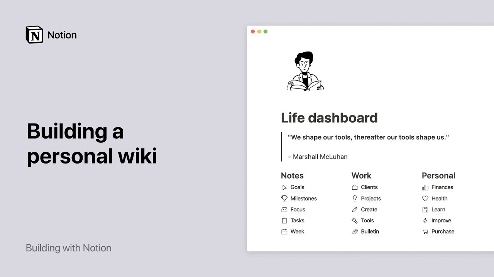

# Build a personal wiki in Notion

**URL:** [https://www.youtube.com/watch?v=Q2G-uVDB28A](https://www.youtube.com/watch?v=Q2G-uVDB28A)
**Date:** 2020-04-17

## Transcript

**[Voiceover]**

"for years we've been watching so many of our users organize their whole lives in notion by building themselves a home base right in the app it works a lot like a wiki does for a company so we often call it a personal wiki or personal home it's one page where you can finally organize all the things are working"

"on that you want to accomplish and that matter to you best of all it lets you go deeper into any of these areas in one click here's what the finished product could look like we're going to build this one from scratch but you can also start building with a template here are real life personal wikis built by notion"

"users that you can duplicate from your template gallery super neat right so let's get the ball rolling here's a workspace I'll start by creating what we call a top-level page in other words a page you can find directly in your sidebar click on the new page button and give it a name my top-level page is now created and"

"sits at the bottom of the sidebar now we can create sections for our page type ford slash heading to add larger text select which size you want and write the name of your headline you can also add this heading by typing the number key twice followed by the spacebar here we'll create four sections notes work life and planning"

"each of these sections can sit next to each other in their own columns this will help you see all your pages at a glance without having to scroll down to achieve this you'll need to manually move your headlines in your page use the six dot icon next to the headline you want to track and drop it wherever you"

"want use the blue guides to help you good stuff you already have two columns created now you can do the same for the two other columns and for clarity let's add a divider line under each header the next step is to add pages inside your personal wiki one way to do this is by typing the forward slash key"

"then Page and pressing enter a brand new page pops open which you can name here and add a small icon to it if you wish here's your first sub page if you already know the sub pages you want to add you can start by typing them here just like any other text select these page titles click on any"

"six dot I con then turn into and page every one of these page titles are now pages of their own all you need to do is select the pages you want to move and use any six dot I con to drag and drop them under their corresponding column change the location of your subpages at any time by moving"

"them like this voila now you can see all your pages at once finally let's add content to the pages if you're looking for a head start select templates and see if there's an already existing template you can use hit use this template and here you have a reading list skeleton that you can modify however you want you can"

"also pay a visit to our template gallery where you will find more ready-made templates many of them are based on real-life pages build by notion users like you you may also access your pages from the sidebar click on the toggle to the left of the top-level page and you'll see your sub pages appear below click on the sub"

"page toggle and you'll see the pages nested inside them too you can nest pages inside pages inside pages infinitely pages and your personal wiki can be as simple or complex as you want them to be for instance a habit tracker like this could be a database where you keep yourself accountable to getting better at exercising or getting more"

"sleep in this plant tracker you can store all the facts in the world about your beloved houseplants this video game database surveys all the games out there that you would like to try with your friends you can even draft a blog post complete with the layout and design you want or start planning your budget all of these aspects"

"of your life are now at close reach let's move on to the fun part customizing your personal Weeki page to your liking personalize it the same way you would with a physical notebook for example add a page icon and a cover image add a quote field and copy and paste your favorite quote in there enable full-width by clicking"

"on the three dot menu at the top of the page and toggling the option on change the text pot and flag this pages favor it so it always appears at the top of your sidebar the end now you have everything you need to build a home base or yourself on notion having everything stored in one place will help"

"you keep track of everything going on in your very busy life and one clean organized space hope this brings you peace of mind the next time you want to plan a hiking trip add a new favorite recipe or capture a quick to do enjoy [Music]"

