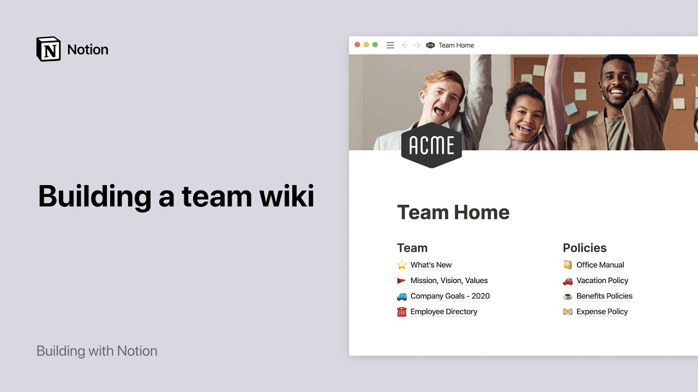

# Build a team wiki in Notion

**URL:** [https://www.youtube.com/watch?v=_fmzW1v3dnE](https://www.youtube.com/watch?v=_fmzW1v3dnE)
**Date:** 2020-05-05

## Transcript

**[Voiceover]**

"are you looking for a place where your team can easily store all their most important information so that it's central accessible and easily findable notion is a powerful tool that allows you to build a knowledgebase perfectly tailored to your team's needs whether you're just a handful of people or a large scale organization picture an online repository where everything"

"is kept up to date from mission vision and objectives to company policies and guides to benefit enrollment one place where every team member can quickly find the information they need without having to tap a colleague on the shoulder or spend time searching for answers this is what we call a team wiki and this video will show you how"

"to make your own well cover building a homepage for your team creating dynamic links to other pages and tips and tricks to keep your information engaging and up-to-date this is what the final product could look like you can actually find and use this template in the human resources section of our template picker but I'll show you how to"

"build it from scratch so you can customize it to fit your needs here's a default workspace with different kinds of pages in the sidebar let's start by creating a new page click on the plus sign next to workspace and give your page a name great my page no sits at the top of the sidebar this is what we"

"call a top-level page I can click on it directly in my sidebar and we can use it to store many sub pages to add a page within your page type the ford slash key then page and press enter a new page is created you can give it a name and add an icon if you wish now let's go"

"back to your team home page and add another page an icon this time I'll steal a template from the template picker to get a head start here are more sub pages you could potentially add to your page exactly the way I just showed you simply click on them to add content inside them which you can structure any way"

"you want I'll go into more detail on this in a minute you can also access these pages by clicking on the toggle next to your team home page in your sidebar open a sub pages toggle and you'll find pages stored inside some of them too you can nest pages inside pages inside pages infinitely this means that there are"

"no limits to how many layers of information your team wiki can contain and everything has its place a neat way to organize all your sub pages in your team wiki is to create headers type the /ki then heading and select the size of the heading you want in this case we'll take a medium sized heading also called an"

"h2 heading press Enter and here you can give your first header a name you can also use markdown shortcuts to add your preferred headings in this case type the number key twice followed by the spacebar let's add two more headers policies and resources let's place all three headers next to each other to do this use the six dog"

"icon to drag a header and drop it next to the first one the blue lines are here to guide you repeat the same action for your last header and there you go you just created three columns in your page you can create as many as you want that way type the - key three times to add a divider"

"under each the next step is to place your sub pages under their corresponding columns select the ones you'd like to move click on any six dot I con to drag them across the page and drop them where you want you can also use the six dot icon to move sub pages one-by-one across your page all right now you"

"can see all your pages at once now why not make your team homepage a little more personal you could add your logo and a cover photo of your team go here to add an icon and click on the upload an image tab to add one from your computer or link to paste an image link click on add a"

"cover then change cover and use one of these two tabs to add your team photo amazing this is what your team's homepage could look like okay now let's move on to the things you can do with these sub pages this page documents a vacation policy all there is for now is text and headings but there are so many"

"other types of content you can add with notion for example type forward slash call-out and press ENTER to call attention to something important you can also add a table of contents to allow your readers to directly jump to the section of the document that interests them just type forward slash TOC and press ENTER this generates a list of"

"automatic hyperlinks to headings on your page if you're using other tools to store information you can also add that content into your notion page embedded Google map showing where nearby restaurants are a figma file with your design systems or components a loom video that captures your sales demo or content from over 500 other apps you can even embed"

"a type form survey to collect information on your team or give people an easy way to request time off with embeds all of your information across tools can live in one place head to the pages three-dot menu at the top right and you'll find a page lock option which prevents other people on your team for making accidental edits"

"or shifting things around turn this toggle on to lock the page unlock your page at any point by toggling it off or simply clicking on the lock icon that appears at the top of the page another cool thing you can do is use mentions to indicate who less updated any page and a time they updated it to do"

"this type the @ symbol followed by the name of the person who lost dated the document if this person is you you can tag yourself then write less updated and hit the add symbol again to feature the time of the last update you can even write words like today or yesterday and they will turn into their corresponding date"

"as time passes this is a nice way to tell people directly who they can ask about the page if they have questions to know exactly when a page was less updated and by who you can click on the 3.9 you at the top right and look at the very bottom you'll see a timestamp for when the page was"

"last edited and by who now the information on your page is structured and accurate finally let's have a look at our sidebar if you have a team plan you'll see two sections workspace and private the former stores pages that are visible to the whole team and the latter is four pages that are private to you as your team"

"grows in scales so will your team wiki each team could even build and oversee its own wiki page and have it appear in the sidebar like this soon you could have your entire organization documenting everything in the same place transparent to everyone with a powerful team wiki like this one your team members will know exactly where to go"

"for the information they need and to speed up their search they can always use quick find at the top left of the workspace after watching this I hope you feel like you can build your own team wiki from scratch now you should know how to create a home page for your team add all kinds of content to your"

"sub pages and keep everything updated and structured the way you like make even the most specific information about your team accessible to all in just a moment whether your squad of five or an entire company of thousands [Music]"

