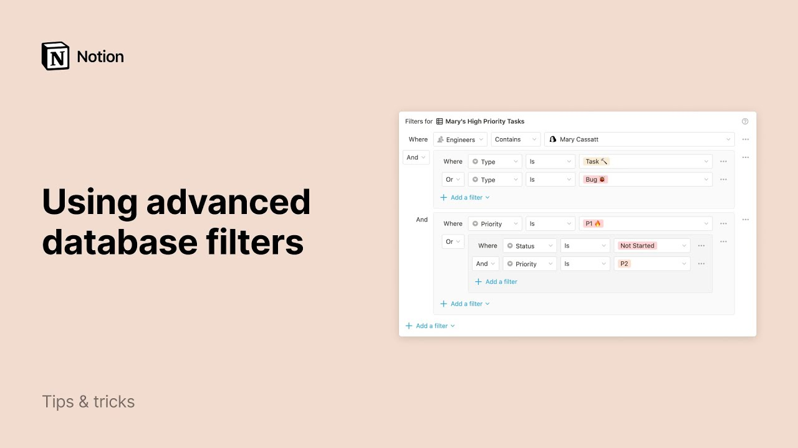

# Using advanced database filters

**URL:** [https://www.youtube.com/watch?v=r2L_1BW7BFU](https://www.youtube.com/watch?v=r2L_1BW7BFU)
**Date:** 2020-07-17

## Transcript

**[Voiceover]**

"notion databases let you store massive amounts of data and visualize your content across tables calendars boards and more with advanced filter capabilities you can make your database views even more powerful in this video I'll show you how to use notions nested database filters and how they can make your task and project workflows more efficient let me show you"

"what I mean using this roadmap database as an example an entire team could share this database to manage company projects and keep track of individual tasks as well each view of this database offers a different perspective of the same data set this tasks view has a simple filter enabled type is task that means that only items tagged tasks"

"will be shown in this view pretty straightforward but filters can get a lot more complex when you need to drill down into the details in the Mary's high priority tasks view you'll see that the filter being used is way more specific the entries shown in this database view have to meet all these criteria the engineer's field has to"

"contain Mary Cusack and the type has to be tasks or bug and the priority level has to be p1 except for tasks that haven't been started yet for those were also including p2 tasks each of the boxes in this window represent a filter group these come in handy when you need to combine and logic and/or logic in your"

"filter you can mess these up to three layers deep for even the most advanced project management workflows next I'll show you how to build a filtered view like this from scratch let's switch to the sales CRM template for another example let's say you wanted to quickly generate a summary of open sales opportunities for this year and their estimated"

"value first open the View menu at the top left and click out of you here let's name it 2020 pipeline first let's add a filter so that we're only looking at deals for 2020 click on filter then add a filter and select the first option you can always change a filter to a filter group later if you want"

"to change your mind select the expected close property which is a date property then click the drop-down to change is to is on after use exact date then select January 1st 2020 deals older than January 1st should now be filtered out of the view next let's filter by deal status click add a filter again but this time choose"

"add a filter group you'll see this box appear inside your filter window select the status property in the filter group and let's add qualified deals now click the add a filter button inside the filter group and add another filter you'll see an and and or drop-down appear next to the second filter here in general you only want to"

"worry about filter groups if you want to combine and logic and or logic in your database view in this example we want to show deals that meet the date criteria and where the status is qualified or proposal or negotiation with the 3-day cons to the right of the filters you can turn a filter into a filter group or"

"vice-versa duplicate or delete your filter just a couple more tips to get the most out of your new database view now that this view is only showing the specific rows you want you can hover over the bottom of any column to use these calculate buttons let's add up the value of these deals by choosing some under the estimated"

"value column and if you want to share this view with the teammate all you need to do is click the three I con then copy link to view when they click on your link they'll be taken straight to the 2020 pipeline view of this database nice work I hope this helps you to take your notion databases to the"

"next level you"

