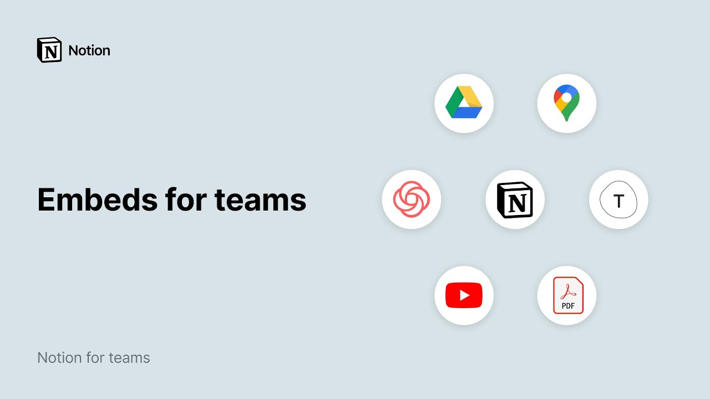

# Embeds for teams

**URL:** [https://www.youtube.com/watch?v=oGkyq7bBP-Y](https://www.youtube.com/watch?v=oGkyq7bBP-Y)
**Date:** 2020-08-24

## Transcript

**[Voiceover]**

"it's hard to stay focused if you're constantly switching back and forth between dozens of browser tabs or different apps on your computer in notion when you embed the services your teammates rely on from google docs to figma and from typeform to github they can spend less time contact switching and have everything they need in one place today i'll"

"show you how to embed these types of content in any notion page we enable over 500 different types of embeds which means that whatever you want to embed is likely supported but we've made a few of them super accessible that our users commonly use we'll go through these here feel free to use the links in the youtube description"

"below to skip ahead let's start with our google drive embed for teams that relied on google docs and sheets before joining notion this really helps to bridge the gap let's say you have an expense report template that lives in your google drive but want it to be easily accessible to your team through your company homepage in notion first"

"click the green share button at the top right of google sheets and set the permission level to anyone with the link can view click the copy link button and go back to notion paste the link anywhere and click embed google drive in the drop-down that appears if you've never used the google drive embed before you'll see this pop-up"

"asking you to connect your accounts once they're connected you'll see a link to your google sheet appear on your page right away anyone on your team can click this bookmark and they'll be taken right there note that you can also connect or disconnect your google account by going to settings and members then my connected apps you can also"

"embed from google drive by typing for slash drive or forward slash embed and pasting the same link the google maps embed lets you include a fully interactive map on any notion page let's add a map embed in the office manual page here first search for the name of a company or its address in google maps click the share"

"button here then copy link go back to notion and paste the link then select create embed in the dropdown that appears you should see a map appear right away when you hover over the map you'll see these black bars appear on its sides click and drag the black bars to resize the embed however you like you can even"

"use these buttons to zoom in and out too just like drive you can add a map by typing forward slash map or forward slash embed and pasting the same link notions embed block also supports pdf files and they're super easy to add just use the slash command pdf and hit enter you can enter a hyperlink here if the"

"pdf is hosted online or upload one from your hard drive once your pdf is embedded you'll see it pop up and can resize it using the black bars scroll up and down to read the entire dock one more note about pdfs you can add these as file attachments too to do that use the slash command file to upload"

"it when you click the file block the pdf will open in your browser where you can download to your hard drive and make your own edits youtube videos are a great way to make your company wiki fun and interactive especially for visual learners start by clicking share in your youtube here then copy the link to your clipboard go"

"back to notion and use the slash command video the video block lets you embed from other services like vimeo or upload your own video files from your hard drive let's paste the youtube link here then embed video now you can watch the video right on this page this can come in handy for your personal note-taking too take notes"

"on whatever you're watching all on the same notion page typeform lets you create beautiful forms and surveys for your team with the typeform block it only takes a couple of clicks to add a form to any notion page for example you might want to use a form to collect vacation requests from your direct reports to do that copy"

"the url of your type form and return to notion you can use the slash command type form or just paste the url right here and select embed type form in the dropdown that appears when your teammates visit this notion page they'll be able to complete and submit the form right here and any changes that you make to your"

"type form will automatically update in this embedded form too use this for pulse surveys feedback requests or anywhere you need quick information from your teammates if you've given the same demo to multiple teammates you should probably make a loom video so anyone can watch at any time it's a great complementary notion for working asynchronously one area where loom"

"is particularly helpful is onboarding and training new employees rather than repeating the same training session with each new hire you can record a loom video and embed it right in your onboarding docs in notion this new hire onboarding page has a loom video embedded right here adding a loom embed works just like the other ones use the slash"

"command loom or just paste it anywhere and click embed loom in the drop down like any other content blocks you can also place them side by side to do that grab the six dot icon to the left and drag to the left or right side of the page like i said at the beginning of the video we've highlighted"

"some common embeds in our product so you can add them by name for all others not available when you type forward slash embed which brings up that part of our menu you can always paste the link here it should pop up for example you can embed playlists from spotify and soundcloud this way when we say that notion is"

"the all-in-one workspace we mean it i showed you how to embed a few different services in your notion workspace but there are hundreds more by keeping everything in one place you can finally close a few of those apps and browser tabs"

