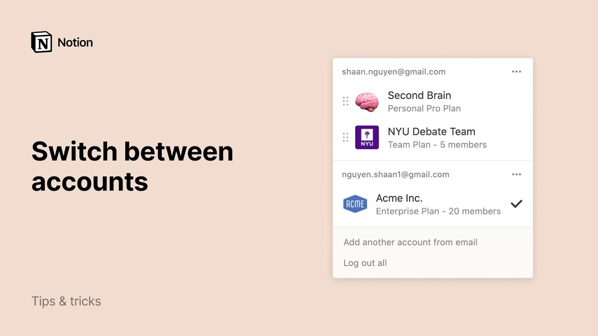

# Switch between your work & personal accounts

**URL:** [https://www.youtube.com/watch?v=8DvGO0lqBaA](https://www.youtube.com/watch?v=8DvGO0lqBaA)
**Date:** 2020-08-28

## Transcript

**[Voiceover]**

"notion is a unique tool because you can use it at work with your team and use it at home for your personal organization with account switching notion gives you the separation you need for a healthy work life balance while making sure they can access any of your content across any account on any device completely seamlessly in this video"

"i'll show you how to use notion workspaces to separate different types of content and how to quickly switch back and forth between workspaces what you're seeing here on the screen is my personal workspace which i named second brain all these pages you see here in the sidebar live inside my second brain workspace when you're brand new to notion"

"it's best to keep it simple and start with just one workspace for example i have a second workspace that i use with my debate team to switch workspaces let's open this menu at the top left of the app and select the nyu debate team workspace all these pages live in the debate team workspace and the pages here in"

"the workspace section of the sidebar are shared with all my teammates in this workspace in the workspace switcher you'll see that there are five people sharing the debate team workspace but the second brain workspace is just me they have different subscription levels too i have a personal pro plan subscription for my second brain workspace and a team plan"

"subscription for the debate team workspace but what if i use notion at work too i have to use a different email address at work but i don't really want to use my work email for my personal stuff luckily notion makes it easy to add another account no need to log out of one account in order to log into"

"another instead click add another account from email and enter your login info it doesn't matter if you use email and password or the continue with google and continue with apple buttons we're in now that i added my work account you'll see that the acme ink workspace that i use at work was added to my workspace switcher even though"

"i use a different email for this workspace acme ink is listed under my work email and my personal workspaces are listed under my personal email in the three dot menus next to each account you can add more workspaces or log out of individual accounts as a friendly reminder personal plan workspaces are always free and include unlimited storage so"

"if you mostly use notion at work you can always create another personal workspace for your eyes only and add as much content as you like such as tasks recipes list of movies to watch whatever you want plus everything i just showed you works on our mobile apps too whether you're at home at the office or on the go"

"notion is your one one-stop shop separate workspaces allow for work-life balance and easy account switching lets you jump back and forth as quickly and as often as you need"

