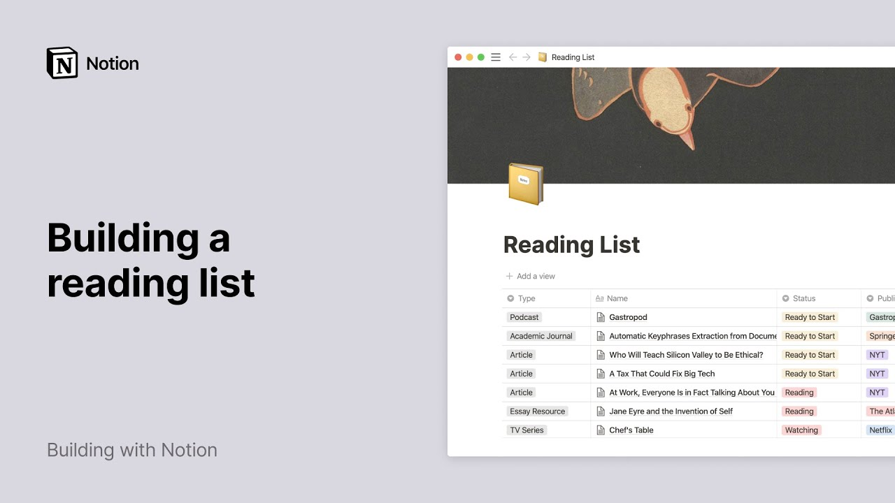

# Build a reading list in Notion

**URL:** [https://www.youtube.com/watch?v=nzHBSxiWGIw](https://www.youtube.com/watch?v=nzHBSxiWGIw)
**Date:** 2020-09-09

## Transcript

**[Voiceover]**

"do you ever find yourself bookmarking way too many browser tabs notion can save you from this headache and help you neatly keep track of the content you want to read watch or listen to and store what you've already consumed this video will show you how to create your own dynamic reading list with notion and use our very helpful"

"web clipper to instantly add content that you wish to keep for later to your list here's what our final list will look like all the information you need stored in one table for me to type in status to publishers and summaries let's start with a workspace and add a new page to it by clicking on table under the"

"database section give your new table a name and add an icon and cover if you wish let's say i want to save the gastropod podcast for later i'll type its name in the first column here where it says name if you hover your cursor over your entry you'll see the option of opening your page click on it to"

"see this page view where you can store all the information associated with your entry a way to add structured and dynamic information is through properties properties are pieces of information about each entry in the table and they can come in many forms like text numbers dates and people properties can be found at the top of every page in"

"any database you create with notion here we have two default properties files and tags let's delete both default properties and add our own click on add a property give your property a name hover your cursor under property type to access the dropdown and pick the property you want to add in this case i want to be able to"

"determine the type of media my new entry is and for this i'll use the single select property great my property is now created now i'm going to type out every kind of media i plan on adding to my reading list for example i'll write podcast followed by enter click here again write another media type and press enter and"

"so on and so forth good stuff every time i add a new entry to my table i'll be able to select the type of media it is by clicking on the drop-down let's add another three single select properties to determine the reading status score and publisher here they are now you can click next to every property and make"

"a selection in the drop-down you created for every one of them another thing you can add is a property called release date and select the date property now you can add a date by clicking on the empty space next to your property and selecting it from the calendar that pops up i'll add a url property which i will"

"use to paste the link of my resource and finally a text property called summary where i can add a short sentence rehashing what i read all seven of my properties are created i can use the six dot icon next to each of them to change their order of appearance click out of the page to go back to your"

"table and there every property has its own column and all your information is visible in one glance every time you want to add another content piece to your table just click on the blue new button at the top right of the table fill out the new page that pops up click out of the page and your new entry"

"is added this is what a full reading list could look like logically there are no scores or summaries associated to the things i haven't read yet there's no need to fill out every property you can also leave them blank now let's go to our web browser say you stumble across an article that sounds interesting but don't have time"

"to read it right this second so let's put it in our reading list of course you can copy the link manually create a new page in your table type the name of the article and paste the url into it but you can also save all these steps with notions of web clipper click on the notion icon edit the"

"name of the content piece if you want select the workspace where your reading list is then use the add to section to choose where you want to clip this article to if it doesn't appear in this list just search for it save the page and you'll see your new entry at the bottom of your table then you can"

"add all the information you want the web clipper doesn't just grab the page url it also collects all the text and images from the web page too that way you can catch up on all these articles you wanted to read right inside notion without all the distractions from reading in your browser with a content heavy table like this"

"one it's helpful to know how to filter your information at the top of your table click on filter then add a filter and here you can say status is ready to start if all you want to see is the content pieces you haven't read watched or listened to yet if you want to see the things you finished change"

"your filter to status is finished and remove your filter whenever you want by clicking on the three dots next to it and remove and we're done we hope this video will help you keep track of all the great content out there in a neat and fun way notion is your second brain a place to store all the interesting"

"books articles and podcasts you stumble across throughout the day happy reading [Music]"

