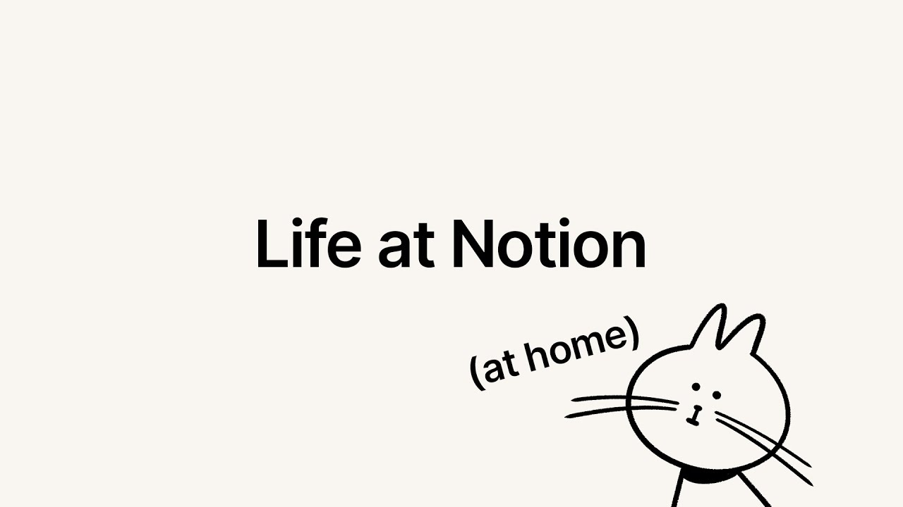

# Life at Notion (at home)

**URL:** [https://www.youtube.com/watch?v=BXnkwpQhv3w](https://www.youtube.com/watch?v=BXnkwpQhv3w)
**Date:** 2020-09-28

## Transcript

**[Voiceover]**

"working from home is uh the flexibility is great but man i miss the office so much i got there and the first thing they told me is i had to take my shoes off and as somebody who collects sneakers that was already slightly off-putting once i got past the taking off your shoe thing i learned that there was"

"something really special here there's a cozy vibe about this place it even carries through when you're using the product notion is kind of like the swiss army knife with software you can use it to take notes build a knowledge base for your startup all in one tool notion has a very distinct artistic style i like to call it"

"like an artist's soul it's not meant to make a huge impression it's meant to kind of fade into the background your notes and your thoughts like that should be the the center when people use notion to handle copic responses or to respond to black lives matter people are able to better do what they want to do with better"

"tools for a lot of tools that are more narrow in scope you have a better understanding of exactly who your audience is but with notion it's anyone and everyone it's everything all the time i'm pretty sure that the head count of notion as a team has more than doubled since we stopped working from the office notioneer sounds weird"

"notion or sounds strange you flip the o and and uh notion at the end it becomes notino i think it just stuck it's a little fun despite being kind of strange and i think that encompasses the team more than they might emit self-included we have this tradition where when a new notino joins they have to present their life"

"story to the company oh hi cara hi i'm glad that we're still keeping that tradition alive we've you know done our best to connect even in a virtual world what should we say in french bon appetit yeah exactly which plague happened in india yes no i definitely have it [Laughter] you do play a part each and every day"

"in building the culture and thinking about moving to notion i had just recently become a new mom henry i had a very open conversation with akshay our ceo and you know he was so amazing he connected me with different professional women in the industry that really helped me let's go i have never been more supported in career development"

"than i have been at notion always going back to that value of feedback is a gift a lot of those things are decided on not because a group of people in a boardroom decide it but because our users ask for it when i can show up to work and explain to our users that we finally polish that rough"

"edge that's what gets me really excited there's a huge amount of things to work on the opportunities to really take like large meaty features or projects and run with it is pretty great for me this is just a prologue there's a lot more to do there are a lot more languages to expand too there are a lot more"

"countries to expand to there are a lot more customers to help there are a lot more potential notino's out there in the world"

