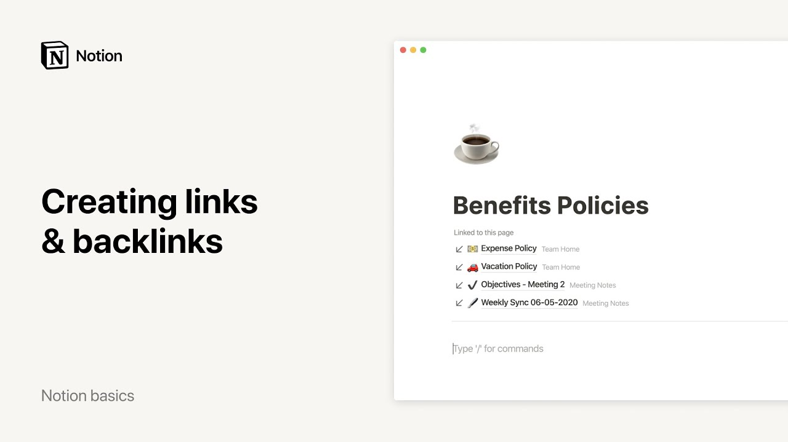

# Creating links & backlinks

**URL:** [https://www.youtube.com/watch?v=GPqNXoM_EJ8](https://www.youtube.com/watch?v=GPqNXoM_EJ8)
**Date:** 2020-10-01

## Transcript

**[Voiceover]**

"as you use notion for more and more things your workspace will grow to hold thousands of tasks notes and docs links help to make connections between related pages and every link makes a backlink automatically this video will show you how to create links and backlinks in notion and how to use them for project management company wikis and note"

"taking let's dive right into this company workspace especially these two pages in the sidebar tasks and projects this page lists out every ongoing project in the company each project is assigned its own page where you can store anything you want assets notes documents and videos related to the project now it's likely that this help center revamp project will"

"be referenced many times in other places in the workspace for instance in a tasks page like this one let's click on the standardized typography card let's assume that this is part of the help center revamp project i can write the following sentence and link to the help center revamp page to create a link hit the open bracket key"

"twice and start typing the name of the page you want to link to click on the page or hit enter when you navigate to help center revamp the backlinks should be collapsed so it should show 5 backlinks click on the button to expand and show all the backlinks inside when you click on any of these backlinks it'll automatically"

"take you to that part of the page where help center revamp was mentioned note that you can always hide backlinks by clicking on the three dot menu here and hide backlinks your workspace will remember your preference to have backlinks shown or hidden across all pages click here to show them again one cool thing about links in notion is"

"that they're dynamic and update themselves that means if you change the title of a page or its icon every link to that page will update automatically here's a couple more places where backlinks can be useful this team homepage contains many subpages for instance in this vacation policy page we may want to add this sentence and create a link"

"to the benefits policies page this allows page readers to discover related pages that can be of interest to them kind of like the references section of wikipedia but created automatically and click here to be taken to the section of the page where the link lives finally when writing down notes you can use backlinks to aggregate notes about one"

"overarching topic let's say you're a literature major and you're taking courses on french and hispanic literature every time you mention a writer in your class notes you can link it to a page that is dedicated to the author that way when you click on a writer's page you'll have immediate access to all your class notes that talk about"

"that writer this can be really useful for research that's all you needed to know about links and backlinks in notion we hope this feature helps you easily connect your numerous thoughts ideas and projects whether you're using notion for work or for yourself"

