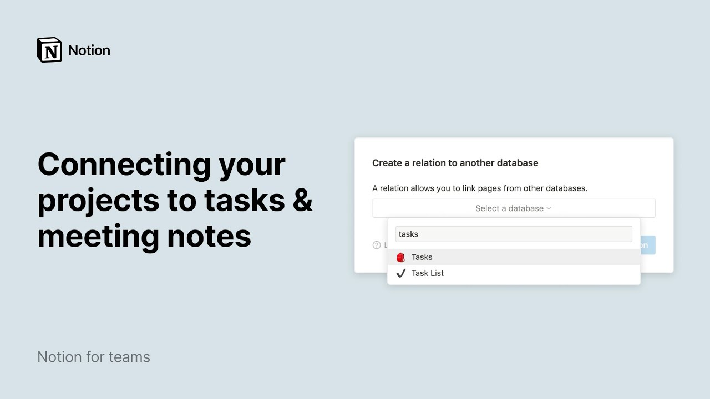

# Connecting your projects to tasks & meeting notes

**URL:** [https://www.youtube.com/watch?v=ho1Mp5RPF1w](https://www.youtube.com/watch?v=ho1Mp5RPF1w)
**Date:** 2021-03-17

## Transcript

**[Voiceover]**

"when you're reading up on the different projects taking place within your company you shouldn't have to hunt around for all the meeting notes tasks or associated docs that are related to that project in notion you can link these all together so that you and your teammates have a quick path to find all the relevant pages you might be"

"interested in keep watching to learn how to connect different databases in notion and provide your team members with more context for the work at hand in the sidebar you'll find what we call top level pages picture these as the main folders for your company departments can create their own folders to organize their specific information or you can create"

"a folder for company-wide info that all teams share like this meeting notes page this projects database holds information about each project the team is working on click on any project name and you'll see that every project has its own page there you can store many types of content from code snippets and videos to pdfs and figma files so"

"it's all organized in one place at the top of each database page you'll find what we call properties pieces of information about each entry in this case the team decided to showcase every project's timeline product manager engineer team and priority every time a new project is added to the database the project owner can fill in the blanks or"

"add other property types like numbers text multi-select menu and url remember that in this video we will connect projects in this database to their corresponding tasks and meeting notes before we show you how to do this let's have a quick look at these two other databases every entry in this database is a specific task that an engineer needs"

"to complete whereas the projects database has more general high-level information about larger initiatives within the company every task in this database is its own page but notice how the information looks different this is a board view where entries are grouped by their status as opposed to plotted on a timeline like the project database what's great about notion databases"

"is that you can choose to view the same information in different ways as a table board timeline calendar list or gallery find out more about database views in this video finally you can see that acme inc uses this list database to store all their meeting notes again click inside any meeting note to add edit or consult content inside"

"now let's do the connecting in the projects database click inside a project in the properties section at the top click on add a new property name your new property in this case we'll call it tasks have your cursor under property type and here you will select the relation property in the advanced section of the drop-down this popup will"

"ask you to select the database you want to connect to your current database either select your database from the drop-down or search for it in the search bar once you see it click on it and hit create relation your projects database is now connected to your tasks database i'll repeat the same steps to connect to the meeting nodes"

"database here you have it two new properties one for each connected database now what we want to do is select the tasks that are relevant to each project click in the empty section next to the property and all the entries from your tasks database will show up then click on the blue plus buttons next to each task you"

"want to link to once you're done selecting all your tasks simply click outside the drop-down and you'll see all the relevant tasks needed to complete every project now if a team member wants to consult a task associated to the project there will be no need to search for that task in the tasks database all they will have to"

"do is click on the relevant task page and it will open up like this note that when you add a relation property to a database the same relation property is automatically mirrored in the related database in other words you'll see the connected project appear as a relation in your tasks database as well as in your meeting notes database"

"click here to rename it and click on the project to be taken back to the project page the same steps apply if we want to connect meeting notes that are relevant to the project click in the empty space next to the property select the notes that apply note that you can find your pages faster by typing their names"

"in the search bar and voila now let's switch to table view to see what a fully connected projects database looks like this is where you can truly see the benefits of related databases now any team member can jump into a project and have full context all the tasks and meeting notes related to a project are bundled together plus"

"you can imagine how this improves collaboration between cross-functional teams finally since relations go both ways you can easily add a task to your test database and specify the project it's related to from here the same goes for meeting notes that's all you needed to know about connecting your projects with tasks and meeting notes this video showed you how"

"to connect databases in notion so you can help your team be on the same page about a project no matter when or where they're connecting from we hope you're now well versed in this powerful feature"

