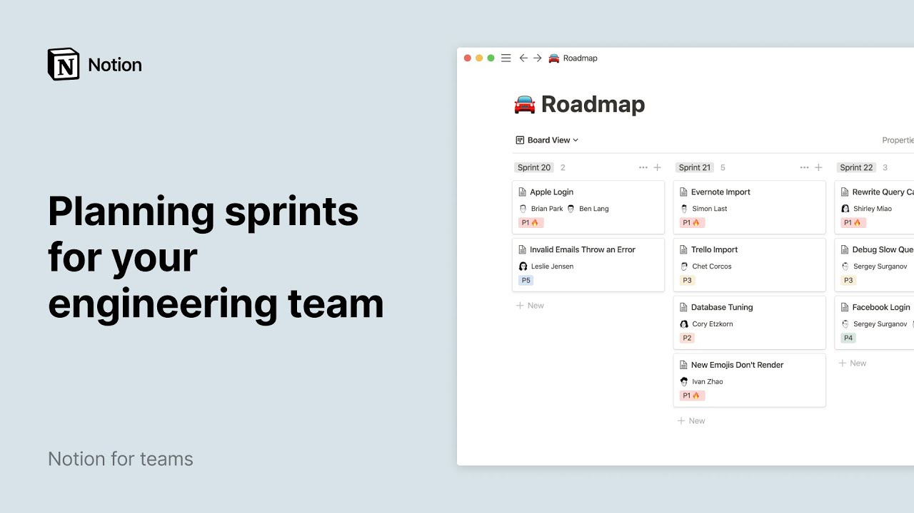

# Planning sprints for your engineering team

**URL:** [https://www.youtube.com/watch?v=2hqD-BIS4Oo](https://www.youtube.com/watch?v=2hqD-BIS4Oo)
**Date:** 2021-03-17

## Transcript

**[Voiceover]**

"bucketing tasks into sprints helps high output engineering teams move projects forward but if these tasks aren't organized it's possible some might slip in a few minutes we'll show you how you can use notion to keep an inventory of tasks and everything related to them from their progression to their priority level and timeline then we'll demonstrate how your team"

"can use our dynamic database views to efficiently plan their sprints let's find the engineering page in the sidebar of acme ink's workspace and click on roadmap this database contains all the tasks your team has to complete as you can see every task is grouped according to its status every entry is its own page where you can add content"

"varying from regular text to embeds from whimsical code snippets and videos at the top are properties which are pieces of information about each database page these properties can take many forms and they can all be customized in this example engineers decided to specify the status priority level product manager and engineers involved in every task as well as the"

"timeline click out of the page to go back to the database now let's add another view to the database simply click on add a view and you'll see this drop-down appear a great thing about notion databases is that you can choose how you want your information displayed either as a table board timeline calendar list and gallery this time"

"i'll select table i'll give my new view a name and hit create here are all our tasks displayed in a table to make your table easier to digest at first glance you may want to hide some of its properties to do this click on properties at the top right and toggle off the properties you do not wish to"

"see this does not delete the properties it simply hides them from view in your table now let's talk about sprints they're collection of tasks that need to be completed within a certain time frame a common type frame for one sprint is two weeks time to assign each task a sprint click on the plus sign at the top of"

"the empty column to the right name it sprint and pick a single select property a new column is created and now all you have to do is add the sprints that correlate with every task type the sprint number then enter to create a tag once it's created just select from the drop-down to use it in another entry we"

"now have a neat table displaying all tasks as well as their corresponding sprints let's sort your tasks in a chronological order click on sort then add a sort pick timeline and ascending now what if we wanted to view all the tasks assigned to each sprint we'd have to add a board view to our database and specify that you"

"want your tasks grouped by sprint this display is beneficial because you get to view all of your team's tasks as well as who they're assigned to for each sprint plus if a task is lagging you can always drag it out of its column and drop it into the next one once the tasks from the sprints are done you"

"can mark them as complete by clicking into the task and picking the complete tag next to status finally let's add a timeline view to this database and call it sprint5 all your entries are now plotted in the timeline as always you can access your tasks page by clicking on its name in order to only display tasks from sprint"

"5 go to filter add a filter add a filter again and select the drop down so that it says sprint is sprint 5. just like we did previously let's display our tasks in chronological order click on sort then add a sort pick timeline and ascending now i'll change the timeline scale to by week to fit the duration of"

"the sprint this database view can be very useful to easily rearrange priorities or simply change the end date of a task and engineers who select this view know exactly what they need to do to complete the tasks in the sprint for more information on timeline views you can consult this video we've now covered how your engineering team can"

"add multiple database views to their roadmap and use them to plan sprints and as your team's needs change notion grows with you you can always keep customizing your workflow as your team grows whether you're starting sprint 1 or sprint 100"

