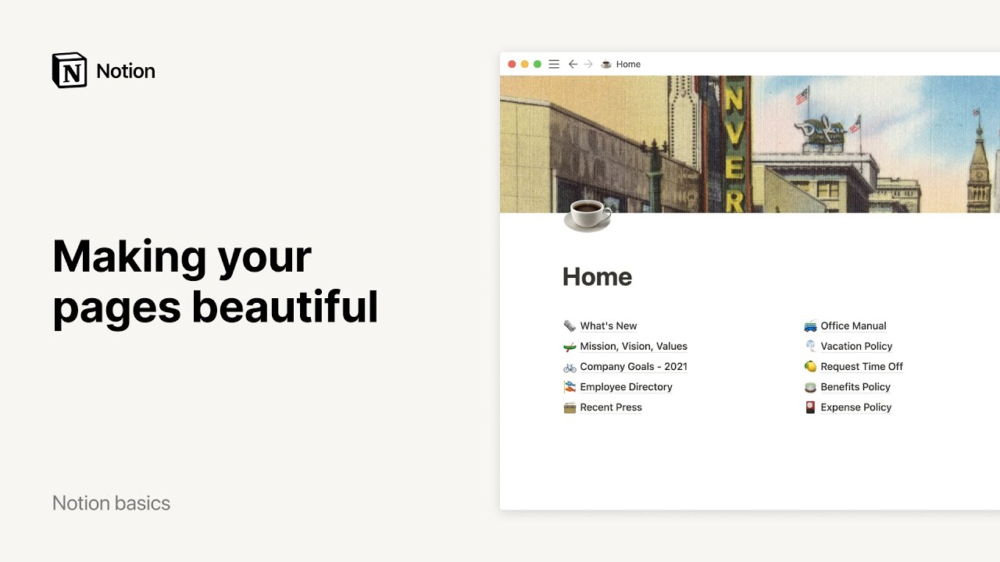

# Making your pages beautiful

**URL:** [https://www.youtube.com/watch?v=1rFGZMKaUK0](https://www.youtube.com/watch?v=1rFGZMKaUK0)
**Date:** 2021-05-14

## Transcript

**[Voiceover]**

"notion is a single space where you can think write and plan it can be whatever you want it to be an online notebook a project managing tool or a to-do list and it can look beautiful this video will show you how to make your content in notion sparkle and by the same token improve clarity and communication within your"

"team this company workspace has top level pages where teams store their own docs and processes notice that each team has an icon which they manually selected from notion's default list of emojis this fun visual cue allows everyone to make better sense of the sidebar and perhaps find what they're looking for faster sitting at the top of the sidebar"

"is the company's homepage this is where they keep important pages about policies announcements and more that all employees share let's inject some color and images into this blank canvas place your cursor over your page title and you'll see an icon and image cover button appear click here to add a page icon a randomly picked emoji will show up"

"and you can click on it again to choose a new one or you can upload your own image or paste the image link here and hit submit note that you can also upload gifs now let's go here to add a cover image to your page similarly this will automatically upload a cover image picked at random hover your cursor"

"over the image then select change cover you may choose to use an image from our gallery we've got images from nasa's archive and the met museum or upload your own alternatively paste your image link here or find one you like from unsplash a vast selection of stock photos to reposition your image click here then drag the image around"

"with your mouse when you're done click on save position already looking nicer right the next thing you could do is add icons to every subpage simply click on the default icon next to the page title here we'll simply select emojis but remember that you can also add your own custom images here you go in just a few clicks"

"your company homepage can look this much nicer this really is a chance to express your team's personality or create a thoroughly branded experience plus your content is now more appealing to whoever lands on this page now let's click into what's new a page dedicated to news about the product all we have so far is text and hyperlinks but"

"there are many more types of content you can add in a notion page we call them content blocks to see all possible content blocks simply hit the forward slash key and scroll for more information on content blocks have a look at this video now what can we do with all this text try turning some into another content block"

"for instance this quote can look like more of an actual quote if you click on the six dot icon next to it then turn into and select quote this title can be turned into a heading click on its 6 dot icon then turn into and select the heading size you want 1 means large size 2 is medium size"

"and 3 is small you may want to turn this heading into a size 3 heading now let's do the same for these two other headings this time try placing your cursor anywhere in the text type the forward slash key then the word turn followed by number three and enter both ways work this one is simply a little quicker"

"let's transform one more content block we're going to turn this piece of text into a call out this creates a box with a default emoji where you can add text that will stand out from the rest of the content callouts are ideal for tips warnings or disclaimers you can customize the emoji as well as the color of the"

"box when you paste a url inside a notion page this box will pop up select create bookmark and it will add a clickable link to the webpage as well as a preview of its content you can even click on the three dot menu at the top right of the bookmark and select caption to add a caption now let's"

"upload an image in this section place your cursor where you want your image to be type the forward slash key then image and either upload one from your computer paste your image link here or pick one from one splash finally say you would like to embed a video in this last section you can do that by placing your"

"cursor where you want your video to appear and pasting the video link it can come from youtube vimeo and a variety of other streaming services this time select embed video in the box to caption this video click here is your content still looking a little bare if so try adding background colors to your section headings click on the"

"six dot icon next to each heading hover your mouse over color and scroll down to select a background color you like above you'll find options to change the color of your text let's add background colors to the two remaining section headings this is what our page looks like so far now you can throw in a page icon and"

"cover image here's another thing you should know your content blocks can easily be moved around the page select any six dot icon next to the content type drag it and drop it wherever you fancy you can even place content blocks next to each other for example in this section say you have two images instead of one you can"

"easily drag one image and drop it next to the other using the blue lines to guide you this automatically creates two columns now you can add any content type inside each column this text for example this is the final look for this page let's go back to the home page and select the employee directory this page is in"

"fact a gallery database where you put visuals front and center each card in this gallery is its own page use it to store all the information you want from regular text and images to pieces of information called properties you can find the latter at the top of each page here the team wishes to show the person's department job"

"title email phone number the date they joined their birthday linkedin profile and their favorite pizza topping to add a new property to your database click on add property hover your mouse under property type and pick your desired property from the drop-down when properties are tags you can alter their color by clicking on the three-dot menu next to each"

"and selecting a new color from the drop-down click out of the page to go back to the database when you click on the properties menu at the top of the gallery you'll find the option to preview your page's content or page cover this gallery is currently showing page content which refers to the image or text that is stored"

"inside every page if you select page cover the image displayed on the card will be the page cover finally click on the drop down next to card size to decide how big or small you want your cards to be this fit image toggle will display your whole images inside their card frames use these toggles to show or hide"

"properties on your card hiding properties does not delete them from the database it simply frees your gallery from details you might not need right now you can find this information again by clicking inside each database card that's it for us we hope to have given you the tools you needed to make your notion pages beautiful and sleek a"

"nicely designed page can go a long way helping bring life to your work and the team behind it"

