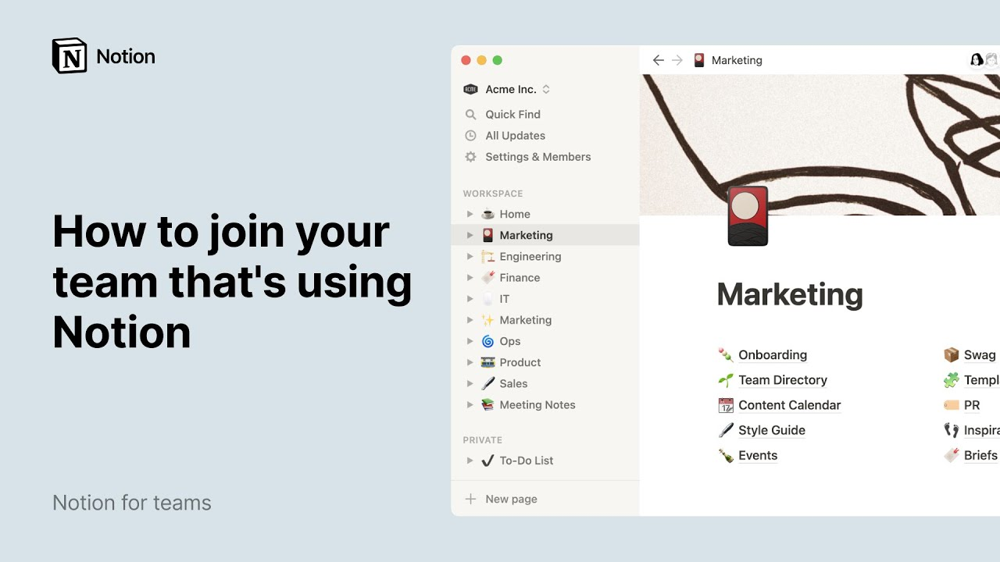

# How to join your team that’s using Notion

**URL:** [https://www.youtube.com/watch?v=1AR3BxFm8fU](https://www.youtube.com/watch?v=1AR3BxFm8fU)
**Date:** 2021-06-04

## Transcript

**[Voiceover]**

"are you joining a team that is already using notion if you're new to our product we're here to help give you a tour of your team's workspace this video is here to help you find your bearings and show you how you can use notion to write plan and collaborate at the moment your team workspace probably looks something like"

"this the sidebar holds what we call top level pages these pages serve as the highest level homes for information in there you can add as much content as you like usually teams will create a top level page for every department in this case the home page displays general company information like employee benefits or vacation policy while you can"

"add just about any type of content in a notion page teams usually use top level pages to store other pages within them these are what we call sub pages where teams can put their specific information into buckets in this marketing page for example the team decided to include a page explaining their own onboarding a marketing team directory content"

"calendar and other specific processes or information about the team a neatly organized team page can really save everyone time and unblock workflows by making information easy to reach if you need to access anything from the marketing department it should be in the marketing top level page same for engineering sales and any other team top level pages are like"

"the top of funnel where you can go to obtain more specific information let's jump into a sub page and see what you can do in there this is the marketing team style guide as a sub page it does not automatically appear in the sidebar however if you click on the toggle next to your top level page you'll see"

"the subpages that are stored within it you can also store pages within sub pages in fact you can store pages within pages infinitely every notion page is composed of what we call content blocks blocks can take the form of regular text call out blogs videos or embeds from a variety of apps to add a content block and see"

"all the types of block you can add place your cursor wherever you want in the page hit the forward slash key and scroll for detailed information about content types in notion watch this video if you hover your cursor over any content block you'll find a six dot icon appear to the left of it click on it to access"

"your blocks menu allowing you to delete the block duplicate it or turn it into another block we'll gloss over the other menu options for now just note that this six dot icon can also be used to drag your block and drop it wherever you like in your page using the blue lines that appears you drag to guide you"

"if you drag a content block next to another one two symmetrical columns will be created adjust their width by clicking on this divider line and dragging left or right pages like this one will probably make up most of your team workspace but there's a chance your team will have more complex information stored in databases what's great about notion"

"databases is that they're highly customizable you can create them from scratch and decide on everything from property types filters and database views this roadmap for example is where much of the engineering team's project management happens every data entry is a page in itself that can hold more content keeping project information neatly bundled together at the top of every"

"database page you will find what we call properties properties are pieces of information about each database entry and they could come in the form of numbers tags dates and people to fill out property information click into the rectangle next to each you can use person properties to assign team members to every task and a select property to keep"

"track of the status you may have already been tagged in a project to complete click out of the page entry to go back to the database you may already know that you can create several database types in notion this particular one is a board database which displays your table entries and columns but you can choose to view the"

"same data in different ways in a table timeline calendar list or gallery this team's roadmap boasts eight additional views with different filters applied to each of them according to the purpose of the view your team might have several views already like project deadlines or bugs you can also create a view that only shows the projects you've been assigned"

"to just note that extra views do not change anything to your database they simply help you see your data for different ends you might also see databases that serve all departments and have them exist as top level pages in the sidebar this meeting notes database stores notes about each meeting being held in the company this ensures that every"

"page is standardized across departments and can also help people from other teams find information quicker it also helps make information transparent across the org notion is a page where things get done if you check your own notifications bar our guess is you've already been tagged in a few projects here's how you too can reach out to your teammates"

"for one you can click on the six dot icon then comment and add a comment in the text box if you have a question about something to direct your comment in someone in particular type the add key then the person's name when that name shows up hit enter on your keyboard then click send another way to connect with"

"someone is via the top of any notion page click on add comment type in your thoughts and when you want to mention a team member type the at symbol again type your colleague's name and what it shows up hit enter then click send page comments are best for anything high level like letting your team know you've reviewed some"

"work you can repeat these exact steps to tag someone in the body of a page add their name at the end of an action item for example these comments are best for specific feedback in case you haven't seen it yet here's what the notifications bar looks like whenever you tag a team member they will receive a notification like"

"this one and so will you in your own workspace you can either click on the page name to be taken to the page where you're tagged or reply directly from there you may have noticed that not all pages in your team's workspace are shared with everyone this is because your colleagues have applied different sharing settings to pages you"

"may decide to keep some pages you create to yourself in this case they will appear in the private section of your sidebar or share pages with specific people only this works great for pages that are work in progress for example if you're an hr professional and you're working on the copy of this careers page you might want to"

"keep it within the people team for now go to our share menu to restrict access to your page by default this page is accessible by anyone in the team restrict this access but give full editing rights to the people team these groups here are permission groups you may already be part of one to find out more about our"

"sharing settings go to this video finally if you're looking for a particular docker database you can simply use our quick find functionality thanks to this feature the answers you're looking for are just a few clicks away that's all for this demo by now you should know your way around your team's workspace from its top level pages to how"

"subpages work as well as content blocks that you can drag and drop wherever you like we also touched upon notion databases and explain how you can add the properties and views you want to make better sense of your data remember that you can use the at key to tag teammates they can restrict or change access to any page"

"in the share menu and that quick find will help you access what you're looking for without having to rummage through pages finally note that you can hide your sidebar at all times by clicking on the arrows at the top right undo this action by clicking on the hamburger menu the beauty of notion is that it can be used"

"in an infinite number of ways a fine-tuned workspace will bring your work to higher more inspiring levels here's to getting more done with your team on notion"

