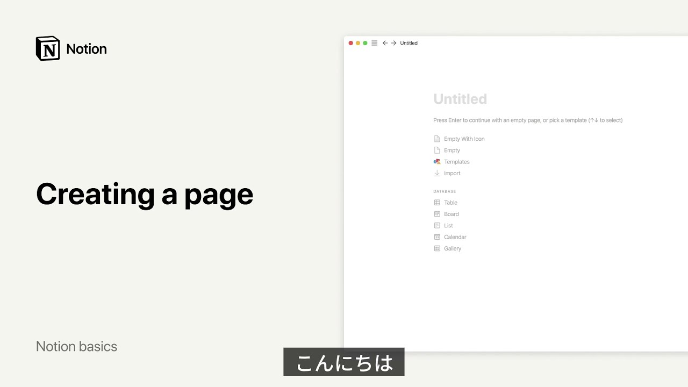

# ページの作り方

**URL:** [https://www.youtube.com/watch?v=W2tyUBYtLFw](https://www.youtube.com/watch?v=W2tyUBYtLFw)
**Date:** 2021-08-04

## Transcript

**[Voiceover]**

"hey there in this video i'll show you how to add a new page to your notion workspace every new page that you create is a blank canvas where you can add whatever content you like from plain text and images to-do lists to powerful databases all pages in your workspace live in the left-hand sidebar to create a new page"

"click the new page button at the bottom left of your notion window you'll see a menu of page types you can click on them to turn your empty page into a table or a board for instance let's keep it simple for now and select empty page let's give our new page a title and some content to get started"

"to see a list of the different types of content you can add to your page just type slash this will pull up the slash command menu with all of the available content types finally let's add a memorable icon to our page to make it easier to find later well done you're ready to turn this page into whatever you"

"like [Music]"

