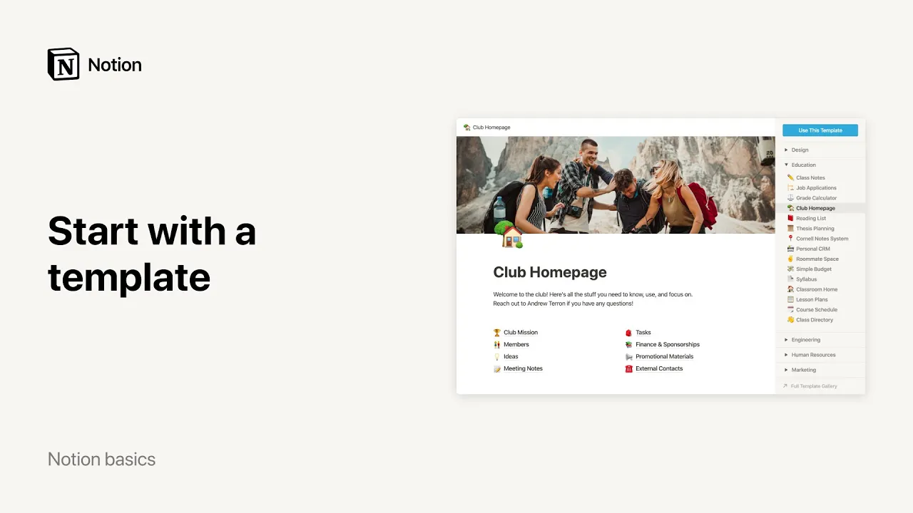

# テンプレートの使い方

**URL:** [https://www.youtube.com/watch?v=1qnhYRFJ5So](https://www.youtube.com/watch?v=1qnhYRFJ5So)
**Date:** 2021-08-04

## Transcript

**[Voiceover]**

"new to notion welcome you can use this for many things but you may not know where to start that's where templates come in handy in this video we'll show you how to add them to your workspace and how they can help you understand what you can do with notion to find our template collection go to templates in the"

"sidebar or access our templates here whenever you create a new page our template picker is separated into sections that will help you navigate it better so let's say you're a student you may be inspired to pick one of these types of pages to add it to your workspace click use this template this club homepage template already includes a"

"few sub-pages so you can start adding your own content right away let's go back to the template picker to add some more pages more advanced databases like this class notes database come with instructions and best practices at the top you'll notice that the database is full of content when viewing in the template picker but once you add to"

"your workspace we automatically delete most of the placeholder content for you once the templates are added to your workspace you can start editing them to your fancy for instance you can hide the instructions at the top and add a cover photo to your page in this class notes database you can start adding your class numbers in this column"

"or maybe you want to tack each class by the professor's name instead you can see templates as teaching tools they will help you better understand the things you can achieve with notion as well as how you can achieve them to browse even more templates select full template gallery at the bottom right of the templates window you'll get to"

"view and use pages created by us at notion but also by a wide community of notion users like you so if you ever find yourself asking what do people use notion for you'll know to turn to our templates for ideas and inspiration as you will find out notion comes in handy for virtually any project whether personal or professional"

"from keeping track of your personal travel plans to creating a detailed content calendar for your company's blog happy exploring"

