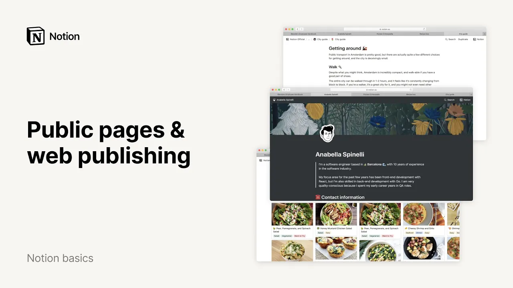

# ページの外部公開

**URL:** [https://www.youtube.com/watch?v=-vqcTVxY5-Q](https://www.youtube.com/watch?v=-vqcTVxY5-Q)
**Date:** 2021-08-04

## Transcript

**[Voiceover]**

"making a website can be time consuming even with modern site building tools notion lets you turn any page into a public website in just two clicks and publish updates instantly in this video i'll show you how to use notions share to the web feature it comes in handy more often than you'd think use it to share an employee"

"handbook with your entire company a resume with a hiring manager a public knowledge base of your favorite video games recipes with your family or a blog like this afsterdam city guide you don't need to have a notion account to view these webpages they exist on the internet like any other site so this feature is particularly helpful when you"

"want to share your creations with someone who doesn't use notion first let me show you how to make your page public go to the page you want to publish to the web and go to the share menu at the top right you'll notice that the share to the web toggle is turned off by default on all pages none"

"of your notion content will be visible on the web unless you switch on this toggle manually but note that any subpages or databases nested in your public page will also be shared to the web when you turn this on let's do it you'll see that the permission level is automatically set to anyone with the link in view and"

"four other toggles appear as well search engine indexing is an option available on our paid plans if you turn it on your notion page will be indexed by search engines like google so your page can be included in search results this may be useful for something like a personal blog but you can also keep it disabled for more"

"privacy allow duplicate as template is enabled by default when you turn on share to the web it lets anyone with the link copy your page into their own notion workspace where they can customize it for themselves this is really useful for sharing templates if you turn on allow comments you can let public viewers create comments and discussions on"

"your page they'll need to be logged into a notion account to do this which is also true of allow editing this option is useful if you want to quickly get people's feedback on a page just shoot them the link and they're good to go now that your page is published to the web click the copy link button to"

"copy the url to your clipboard or copy it from your browser's url bar let's see how it looks nice work a website in two clicks you can share this link with friends and teammates via email text message slack or however you like and this is what they'll see if you're logged into your notion workspace in your browser all"

"you need to do is open an incognito window to preview your page one cool thing about public notion pages is that updates are published instantly for example if i make any edits to this release notes page anyone with the link will be able to see updates made in real time if you have a big update to your public"

"page that you want to prepare privately ahead of time you can use another page with share to the web turned off and name it something like staging or drafts then when your update is ready to publish just click and drag to select the content grab the blog handle to the left and drag into your public page using the"

"sidebar on our public release notes page let's drag this content to the top and once everything looks perfect we'll turn on page log in the three dot menu at the top right to make sure you and your teammates don't make any accidental edits that's it with notion building and publishing a website has never been easier"

