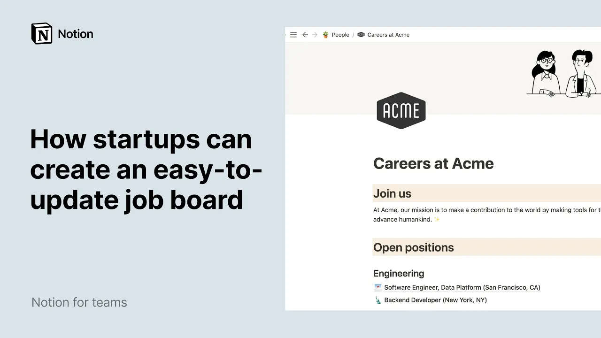

# How startups can create an easy-to-update job board

**URL:** [https://www.youtube.com/watch?v=jaWX0iO5XDE](https://www.youtube.com/watch?v=jaWX0iO5XDE)
**Date:** 2021-11-04

## Transcript

**[Voiceover]**

"your startup is growing swiftly and you need to hire so positions are opening up fast this is a good problem to have yes maybe you've hosted these on a website in the past but updating jobs closing them making changes all these usually require engineering support and that's precious time taken away from the engineer's core work and missing out"

"on applicants seeing your post you can create a jobs page with notion without having to ping your engineers for help all you have to do is store your job listings in a notion page and publish this page to the web your job board could be ready in minutes watch us here's a page dedicated to the people team of"

"a company called acme inc we're going to add a page within this page let's place our cursor where we want our page to exist hit the forward slash key followed by the word page and enter a brand new page is created let's give it a name in this case we'll call it careers at acme then you can press"

"enter to access the body of the page or simply click on the empty button it's now time to add your content to speed things up we'll simply copy paste an outline of job categories and listings but you can also use this space to draft your text and iterate on it with colleagues until everyone gives the green light this"

"is the list of positions that are currently open at acme the first thing we'll do is turn each of these into a page a quick way to do this is to select the jobs with your mouse click on any six dot icon from the selection and in the menu that shows up hover over turn into then click on"

"page now that every job is a page in itself you can click into any one of them and add your content in the body of the page we'll go back to these job pages in a bit now it may happen that you'll want to include links to other notion pages for example in this section we want potential candidates"

"to be able to consult our guide to interviewing at acme which is a page that already exists in your workspace to conjure it up hit the add key followed by the name of the page as soon as the page shows up in the drop-down click on it voila your page link is created amongst other things mentioning pages ensures"

"that everyone is looking at the same document not an outdated copy now that our careers page is complete with texts subpages and links to other pages we can move on to making it look good remember that headings help candidates visually navigate postings so we'll want to use level 1 2 and 3 headings accordingly to denote important sections and"

"subsections of our page perfect since this last section is a little long why not fit it into two columns try selecting the blocks you want to move with your mouse and dragging them left or right using the blue lines to guide you a brand new column is created and now you can simply select the rest drag it and"

"drop it in the empty column to the left now let's make the statement stand out by turning it into a call-out block and click on the randomly generated icon to pick one you like speaking of icons it would be neat to add one for each job description in this case the company has offices in san francisco and new"

"york let's pick an icon for each city and add them accordingly good stuff to make sure our sections are perfectly discernible we can add a color background to their titles click on the title six dot icon and this time hover over color you may want to pick a color background that matches your brand colors repeat the same steps"

"for open positions and benefits the next thing we'll do is add an icon and page cover to your careers page scroll up your page hover your cursor over your page name and click on add icon notion will assign you a random icon and you can click on it again pick the upload and image tab then choose an image"

"to upload your own let's select the company logo to add a cover image click on add a cover equally a random image will appear to change it hit change cover again let's upload a branded cover image now let's fill out these job sub pages there are so many content types you can add in notion like images web bookmarks"

"or code snippets what's more you can embed content from more than 500 apps directly into a notion page if your company uses greenhouse to manage applicants you could paste a link to her greenhouse page and select create embed adjust the size of the window with your mouse this specific embed actually shows notion's very own job listings on greenhouse"

"we're just using it here for demonstration purposes with an embed like this one your future candidate can apply directly from your notion page alternatively you could simply provide a contact email your job board is now ready the very last thing we'll do is publish this careers page to the web let's go to the share menu at the top"

"right of the page and click on the share to the web toggle to turn it on you can leave the first three toggles off and turn on search indexing your notion page now also exists as a web page and you can find its url here hit copy to copy it to your clipboard before you start sharing your link"

"on all platforms you may want to lock it first this prevents any accidental changes on the page by team members this is what your job board looks like as a webpage you now have a branded careers page that future candidates can consult at ease all that without writing a single line of code and if you spot a typo"

"or want to add a new position you can do so from the comfort of your notion workspace and the changes will update in real time enjoy building your own job board and check out our job board template linked below for inspiration [Music]"

