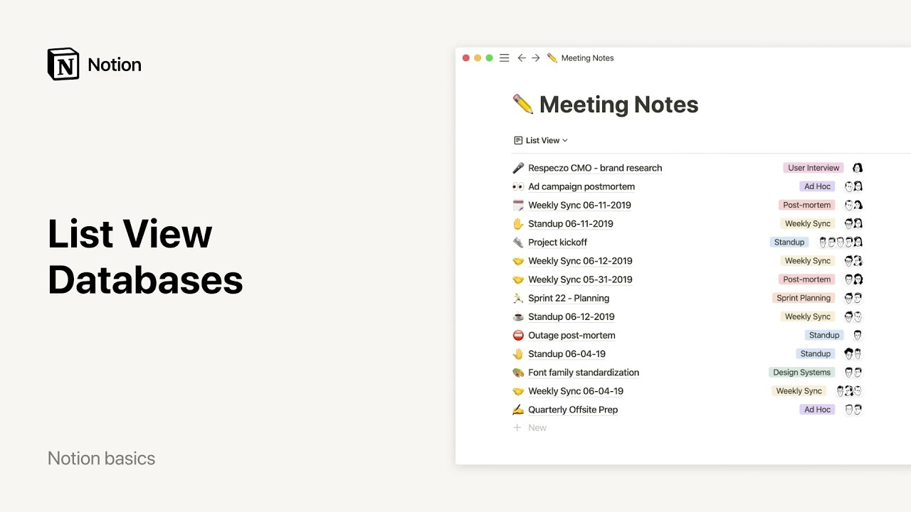

# Listas - Bases de datos

**URL:** [https://www.youtube.com/watch?v=liiHsaPWjiI](https://www.youtube.com/watch?v=liiHsaPWjiI)
**Date:** 2021-12-23

## Transcript

**[Voiceover]**

"hello in this video you'll learn how to create a database of information as a list lists are more minimalist than other database views making them ideal for creating a simple index of documents meeting notes journal entries or simple to do's here's an example list as you can see it's a database of meeting notes which lets everyone see the"

"name of the note set the data was created who was there and the type of meeting it was each of these properties are pieces of information about each entry in your list lists are handy because they display property information very simply here on the right hand side this makes it easy to get a lot of context about any"

"given item in your list at a glance to add properties to your list click properties and then add a property you'll be prompted to choose what kind of property you want to add whether it's a text field a number field a person a date a check box etc and give it a name for instance the property called participants"

"is a person property which allows me to tag my teammates who were in a meeting with me you could see more detail about these properties by clicking on the name of any item this opens as its own hold notion page where you can store all the relevant information you want all your properties are listed and can be edited"

"at the top of the page so there's no need to show them all in your actual list to determine what properties to hide or to show just go to properties and toggle your properties on and off accordingly hiding properties in your list allows you to focus only on what's helpful to know like with other databases you can filter"

"your list to only show what you need to apply a filter click that button at the top of your list select the property you want to filter by then specify the criteria you want for example you can say only show notes from daily stand-up meetings your list will change in real time you can also change the order of"

"your list by sorting your data for instance if you wanted to organize your meeting notes so the most recent meeting appears at the top you could say sort date created descending now if you click on add a view here at the top left you'll see that you have the option to add a different view of the same list"

"a list view is nice and minimalist and boasts all the power of a database without the clutter but you can also decide to view this data on a calendar on a board or in a table you can create views with different filters and sorts and easily switch between them here i can switch between my full list of meeting"

"nodes and a view of only notes from daily stand-up meetings to find out more about the cool things you can do with database views check out our videos on galleries calendars boards and tables we hope lists help you stay organized in style"

