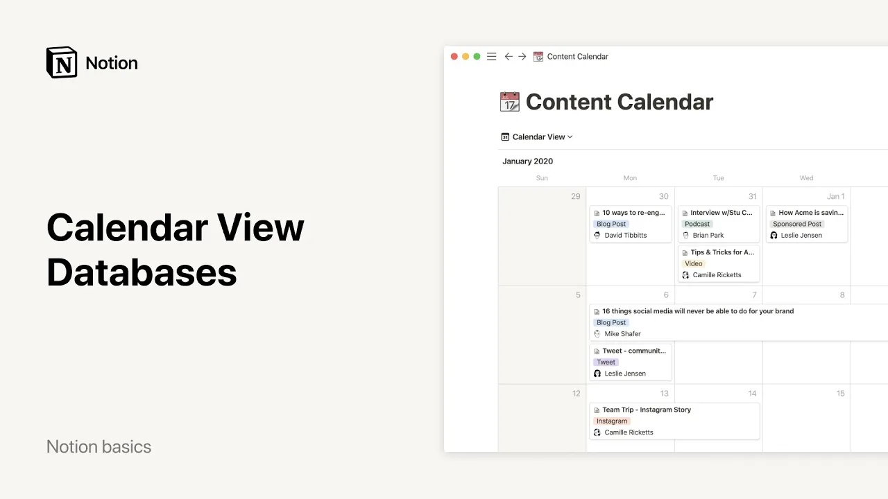

# Calendario - Bases de datos

**URL:** [https://www.youtube.com/watch?v=tQ_gDYIZqQo](https://www.youtube.com/watch?v=tQ_gDYIZqQo)
**Date:** 2021-12-23

## Transcript

**[Voiceover]**

"hello this video will teach you the many ways you can use calendars in notion to keep track of events deadlines schedules and more in notion calendars are databases that allow you to organize information by date as an example here's a content calendar for a company's blog every item you see on the calendar here is a post you could"

"use the calendar to show deadlines for posts by putting them on those dates or to show which dates you plan to be working on a post to add an item to a calendar hover over the day you want to add it to and click the plus sign to extend an item over more than one day click and drag"

"its edges to cover that date range each item on your calendar can be opened as its own notion page where you can add all the information you want like properties denoting who is working on the post in question or what type of media the post is so for example podcast or blog you could also use the body of"

"the page to collect all your research interview recordings or even full drafts of what you want to write when you view an item as a page you'll see properties at the top where you can also edit them properties or pieces of information about each entry in your calendar notion lets you work with many different types of properties like"

"dates people single select menus multi-select menus numbers text and more to add a new one go to properties and click add a property you'll be prompted to choose the type of property you want and give it a name a nice thing about properties is that you can decide whether to show them or not on your calendar to do"

"this toggle on the properties you want to show and toggle off the properties you want to hide should you only want to display your page title just toggle everything off in order to use a calendar your database must contain at least one date property if you decide to add another date property to your database you'll see this drop-down"

"appear another calendar will be created in parallel around the second date property in this example we have two date properties deadline and publication date so we also have two calendars the one showing all deadlines and the ones showing all publication dates you can switch between the two with just a couple clicks just like other types of databases in"

"notion you can filter calendars to only show items that fit specific criteria so for example you can click filter at the top and specify that you only want to see posts assigned to aleks your calendar will change in real time finally let's talk about views a calendar is one of multiple kinds of database views you can create with"

"notion you could also view the same data in a table on a board and a list etc calendars just make it easier to see your information organized by date specifically to create a different view of your calendar click add view at the top left you can choose which type of view you want and give it a name you"

"can also create views showing different filters applied to your calendar then switch seamlessly between them using the view menu that's pretty much it if you want to learn more about other types of database views you can watch our tables gallery lists and boards video hope this helps you and your team stay on schedule [Music]"

