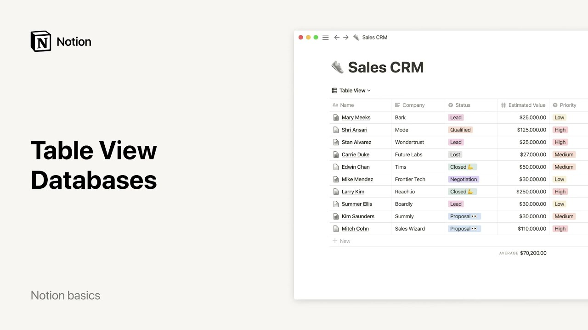

# Tablas - Bases de datos

**URL:** [https://www.youtube.com/watch?v=Ww_DyqCZcPM](https://www.youtube.com/watch?v=Ww_DyqCZcPM)
**Date:** 2021-12-23

## Transcript

**[Voiceover]**

"hello this video will show you how to get the most out of tables tables provide an efficient format to store and organize information for example in this editorial calendar each article has tags deadlines and people assigned what makes notion tables so special is that they are dynamic each row can be open as its own page and you can"

"pick different ways to view your data i'll go through each of these concepts now what are properties there are pieces of information about each entry in your table like deadline as you can see in table view each property is represented as a column notion lets you work with many different types of properties like dates people single select menus"

"multi-select menus numbers text and more depending on the type of property you'll get different options for instance if you have a date property column clicking on it will bring up a calendar to choose a date if you have a person property column you'll be prompted to tag people in your workspace you can hide any of these columns by"

"clicking on the property name and selecting hide alternatively toggle off the properties you want to hide hiding properties can be useful when you have a lot of information in your table but only want to focus on some of it for instance let's say that today all you want to view in the sales crm is companies emails and status"

"you can hide everything else like this as i mentioned every item you add to a table can be open as its own notion page there you can keep as much information as you want about that item in one place so for example if you're working on the story about tips and tricks you can open this page to keep"

"all your research images interview recordings and more everything you need to make this story a success is right here you can even add pages inside the page if you want to store multiple drafts for instance add as many layers of information as you want now let's say you want to quickly see the status of all your sales leads"

"in the view menu you can add a view which i will call by status then select board and status here voila now you have a kanban board where every lead is its own card grouped by status and you can easily drag and drop any card to move it through your process when you create different views you can easily"

"switch between them in the view menu and look at whichever view is most helpful for you at the time views become even more helpful when you apply filters and sorts to the data in your table let's say you only want to see leads that are high priority you can create a new view that's also a table but then"

"apply that particular filter by going here and changing the criteria to priority contains high your table will change immediately to only show leads that match that criteria and because you've created a new view you can now switch between your unfiltered table and filter table with a couple of clicks the same thing works when you apply a sort no"

"need to reinvent the wheel each time those are the basics but there are a few more cool things you can do with tables if you already have existing data in say an excel or google sheet you can add it to your notion table to do this go to the three dot menu at the top right corner of your"

"page and select merge with csv if your text is too long for the width of your column you can click on the wrap sales options which you can find in the table's three dot menu you can also use tables for calculations hover over the bottom of each column and here you'll find the calculate option click on it and"

"a few options will show up these depend on the type of information the column contains for a number column you can sum up the numbers or calculate an average for a dates column you can calculate your data's date range that's pretty much the gist for more information please watch our other videos on database views have fun creating your"

"first table with notion [Music]"

