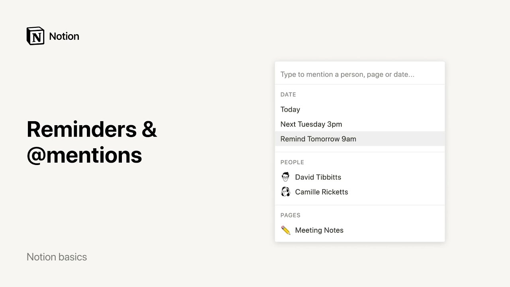

# Recordatorios y @menciones

**URL:** [https://www.youtube.com/watch?v=YQBjaW_68qE](https://www.youtube.com/watch?v=YQBjaW_68qE)
**Date:** 2021-12-23

## Transcript

**[Voiceover]**

"hello in this video i'll help you use mentions and reminders mentions are a quick and easy way to link to other pages in your workspace bring specific content to the attention of colleagues and set up timely reminders for yourself and others to bring up all these options just go to any notion page and type the at symbol that"

"opens the mention menu with three choices you can mention a date a person or a page let's start with this example these are minutes from a team meeting here i'll type the add symbol on my keyboard and start typing the title of the page i want to mention once it shows up i select the title and ta-da the"

"page in question is now hyperlinked here in my action items list now let's say this action is assigned to someone in particular i can mention them here so they'll know it's for them again i'll type at then start typing my colleague's name until it shows up select the name and there valerie will be notified of this mention in"

"their own workspace in the sidebar you can also mention colleagues in comments within a page finally use the add symbol to add a timestamp on a page for instance once you update this page you can document the date like this you can even write words like today tomorrow or yesterday and they will turn into their corresponding dates as"

"time passes now let's set up reminders in this weekly agenda i would like to add a reminder for peter's birthday i will type at and the word remind followed by the day and time i would like to get the reminder here i'll say remind monday at 2pm which means that i will get a reminder on the upcoming monday"

"at 2pm i can also manually alter the date and time of my reminder here or simply click on these options reminders can also be used in databases here's a list of tasks and here are their deadlines if you want to be reminded of deadlines click directly on the date and go to remind if you want more granular reminder"

"options you can enable include time you can also choose from more options for exactly when you want the reminder to be received if notion is open on your device when the reminder pops up it will be sent to all updates in the sidebar and you'll see a red badge appear if you have the notion desktop or mobile apps"

"you'll receive a push notification you can customize your notification settings by going to settings and members then my notifications there you go mentions and reminders demystified connect pages colleagues and due dates in just a few taps [Music]"

