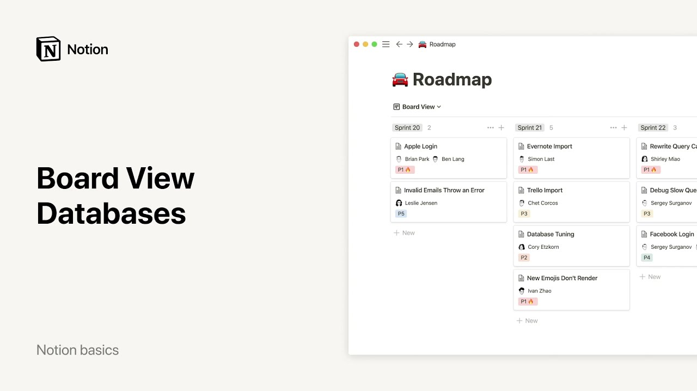

# Tableros - Bases de datos

**URL:** [https://www.youtube.com/watch?v=BM9cdjAFAl4](https://www.youtube.com/watch?v=BM9cdjAFAl4)
**Date:** 2021-12-23

## Transcript

**[Voiceover]**

"hello there in this video we'll talk about boards how to create them and how to make the most of them in notion boards are a specific way of displaying a database where items are cards organized into columns often people will use them to visualize stages of a process like on a kanban board in notion boards are designed to"

"be your ideal companion for project management here's an example of a board for tasks that could be shared by an entire team as you can see every task is a card and cards are grouped based on their status to do doing and done cards can be easily dragged and dropped between columns so you can literally move projects forward"

"through your process as you complete them here you can see that board cards are grouped according to people you can either view the tasks according to the product manager or the engineer working on it in each case these groups are based on properties properties are pieces of information about each card on your board for instance on this task"

"board there are two properties status and did created to add a property to your board click add a property you'll be prompted to choose what type of property you want to add whether it's a text field person date etc and give it a name i can decide to show these properties directly on my cards by toggling them on"

"or hide them by toggling them off hiding properties can help you simplify your board and focus only on what matters you'll notice that every card on your board can be open as its own notion page where you can store all the information you want properties will appear and can be edited at the top of that page just like"

"galleries in notion boards allow you to have neat card covers images displayed right on your board view you have several choices for how to do this given that each card is a notion page you can add a cover image to a page and have it show up as your card cover on your board or you can choose page"

"content and the first image in the body of your pages will show up as the card covers and if you have a file property and use it to upload images to the cards on your board you can have those images display as card covers one other formatting option you can pick your card size small medium or large finally"

"what makes boards unique is that you can group your cards by property you can even create multiple views of the same board that allow you to view your database differently in this case our cards can be grouped by engineers task type sprint number product manager priority or status in the case of this road map cards can quickly add"

"up in the completed column a way to avoid too much data congestion is to hide the column click on the columns 3 dot menu and select hide you will still be able to drag and drop your cards in this column as you'll notice you can also rename your columns by clicking on their headings as with other database types"

"you can filter and sort the data on your board for example you could apply a filter to only see cards that represent tasks assigned to joe your board immediately changes to hide all the other cards that don't fit that criteria also like other database types you can view your board many different ways as a table calendar etc you"

"can create as many views of the same data as you want and switch between them using the view menu at the top left corner of your board you can also create views based on different board groupings or filters that way it's easy for you to toggle between your full board with all your projects and a board showing only"

"projects that are high priority want to find out more about our other database views check out our videos on galleries calendars lists and tables we hope this helps you run clear processes [Music]"

