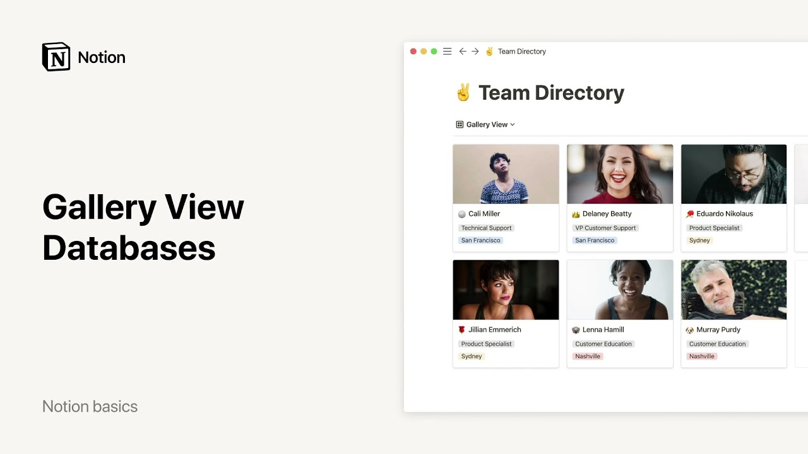

# Galería - Bases de datos

**URL:** [https://www.youtube.com/watch?v=aBQuMkuk2Xg](https://www.youtube.com/watch?v=aBQuMkuk2Xg)
**Date:** 2021-12-23

## Transcript

**[Voiceover]**

"did you know that you can use a notion database to beautifully showcase photos and other images in a gallery this video will show you how to add a gallery to your workspace and customize it according to your needs like boards in notion galleries display every item you add as a card and every card can be opened as its"

"own notion page what's really nice about galleries is that these cards are very customizable and you can display a visual or preview of the contents of the page i'll share the different ways that you can make this type of database your own for example this gallery is a team directory showing photos of every team member first notice that"

"each card has its own page where you can add all the information you want as properties or in the body of the page so job title office location favorite dessert linkedin a bio and a photo of the team member as you can see this photo is the same that is featured on the cover of the card in the"

"gallery to choose what you want your gallery to display go to properties and click on cart preview you'll find different options page content will grab the first image displayed inside the page and use it as the card cover if there is no image on a page the card cover will show a peek of the card's other content like"

"text or to-do list page cover will grab the cover image of the page and use it as a card cover finally the none option allows you to get rid of card covers altogether the next option for formatting your gallery is card size this one is pretty self-explanatory you can choose to have small medium or large cards the default"

"image ratio is 69 but if you want your images to appear in their original ratio just toggle on fit image if you want your image to fit the card frame you can also reposition it by hovering over the image and clicking reposition then dragging it into place finally you can play around with these toggles in the properties menu"

"to choose the information you would like to show under the card cover if all you want to show is images you can turn all the toggles off including the name toggle looks neat right notion makes it easy to view the same database several different ways and switch between them anytime just go to the view selector at the top"

"left here you can view your information in a table that's all for now on galleries to learn more about using other types of database views see our calendars tables lists and boards videos"

