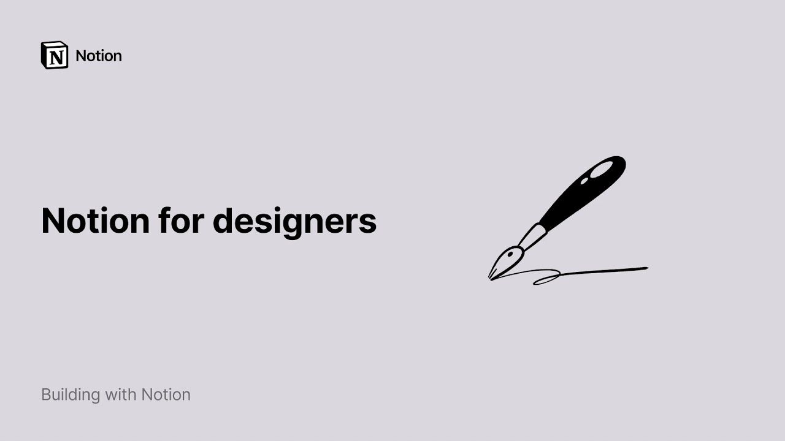

# Notion para diseñadores

**URL:** [https://www.youtube.com/watch?v=tdf-PKlj4Jc](https://www.youtube.com/watch?v=tdf-PKlj4Jc)
**Date:** 2021-12-23

## Transcript

**[Voiceover]**

"hello if you're a designer toying with the idea of joining notion or better yet if you're already using it this video is for you notion is a clean surface where you can add content share and iterate with other collaborators it can be your go-to place for task management meeting notes or even user research data if all you have"

"is a blank workspace head to the template picker for inspiration in the design section you'll find ready-to-use templates that you can modify as much as you want if you find one you like add it to your workspace by clicking this button this is a design system database in other words a single source of truth which groups all the"

"elements that will allow your team to design and develop a product what's special about notion databases is that every entry is assigned its own page in there you can add all the relevant information you like this information can take many forms text images videos but also code snippets figma files and pdfs i'll go back to a couple of"

"these content types later at the top of each entries page you'll find what we call properties pieces of information about each entry this template already contains four properties date created date last updated the pages owners and the page's status to add a new property to your database click on add a property and select a property type from the"

"drop-down it can be a url single select menu multi-select menu numbers and more this database enjoys a couple of alternative database views you can find them by clicking on the view menu and selecting them in the drop-down a great thing about notion is that it allows you to view your data in many different ways by default this template"

"is built to show your content in a gallery but you can also see it displayed in a list or on a board where entries are grouped according to their status this comes in very handy when you're trying to process the same data for different ends once your design system is ready to be shared with others perhaps with people"

"external to your team you may want to publish it to the web to do this go to the share menu and turn the share to the web toggle on your page now exists as a public url and all you need to do is copy the link and share it with whoever you want a meeting notes database will help"

"you keep track of what's being said and decided in meetings whether it's to refresh your participant's memory or share the minutes with a team member who couldn't make it you can add as much or as little content as you want to these cards from simple bullet notes to figma embeds for the latter just type the forward slash key"

"then figma and paste your figma url your figma file will appear within your page you can embed content from multiple apps in a notion page from envisioned visuals to content from framer abstract whimsical and mirror just type the forward slash key then embed to see all your embedding options and if your design team has recurring meetings such as"

"design critiques you can create custom templates to quickly add some structure to your meetings rather than typing it out from scratch every time just use this drop down next to the blue new button to create or use a template here's what a design crit meeting notes template could look like finally note that you can add code blocks to"

"any page by hitting forward slash then code paste the snippets you use frequently in there and click on the drop-down to select the language you want the option to copy your code is at the top right of your snippet to make these code snippets even easier to find later click favorite at the top right of your page that'll"

"pin it to the top of your sidebar for easy access that's all for this video feel free to view more tutorials like these to familiarize yourself with notion or go to our template gallery from the template picker where you'll discover a created set of real-life templates made by a rich community of users with all this in mind you"

"should now have the tools you need to make notion your ideal design companion [Music] you"

