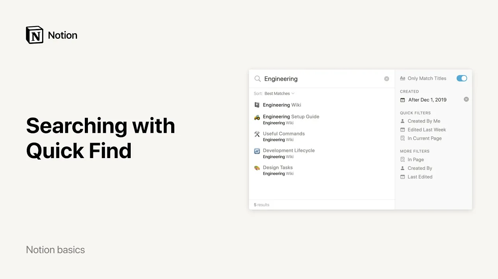

# Procurando na busca rápida

**URL:** [https://www.youtube.com/watch?v=XTeR80caSc8](https://www.youtube.com/watch?v=XTeR80caSc8)
**Date:** 2021-12-23

## Transcript

**[Voiceover]**

"looking for something use quick find when you store lots of information in notion or your colleagues build a complex wiki full of team knowledge it's almost like having a second brain quick find makes sure that you can search for and jump immediately to any page or content so you can always find what you need to open search click"

"the quick find button at the top left of your sidebar or use the keyboard shortcut command and p if you're on mac or ctrl n p if you're on windows once you start typing you'll see quick find start to bring up some search results you can use the arrow keys on your keyboard to navigate these results or just"

"click on the desired page to go right there search results prioritize pages you frequently visit the more you search the more accurate your rankings will be we also consider additional factors such as how recently a page was edited to improve results now that you've searched for something you'll find it listed in recent searches next time you pull up"

"the quick find window you'll also find the pages that you've been to most recently listed under recent pages for more advanced searches you can filter and sort too let's say you and your team share a massive database to keep track of all your projects but you're looking for something that you created on a certain date pull up the"

"quick find window and enter your search term click on add filters to bring up a sidebar of search options first let's add one of these quick filters created by me now quick find will only show results from pages that i created let's filter our results to only include pages created after september 1 2019 but before december 31st if"

"you're searching for the title of a page rather than something in the contents of a page you can turn on only matched titles to make the search results even more accurate you can also sort this list of search results to meet your needs sorting by best matches will prioritize the most relevant pages in content giving priority to page"

"titles and recently edited pages you can also sort by created date or last edited date if you need to search for the value of a database property such as database items labeled urgent you can use the search bar at the top right of that database to quickly filter the results quick find works for everything else with your second"

"brain hosted in notion you're free to store anything and everything you want and always have it at your fingertips [Music]"

