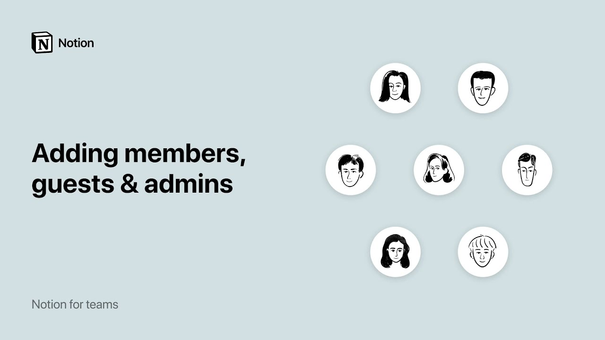

# Adicionando membros, convidados e administradores

**URL:** [https://www.youtube.com/watch?v=YlpuPrdJoUY](https://www.youtube.com/watch?v=YlpuPrdJoUY)
**Date:** 2021-12-23

## Transcript

**[Voiceover]**

"in notion you can customize permission levels so that your colleagues collaborators and clients only have access to the pages and settings they need let me show you how notion is built to scale with your team as you grow so the different permission levels help to make sure your workspace works the way you want it to for 10 people"

"or a th people to get started click settings and members in your leftand sidebar let's say you're on a team plan in the access level column you can see who's an admin in the workspace and who's a member admins and members have access to all the pages that are shared with the team guests are listed below these are"

"people external to your team who only have access to the specific pages that were shared with them you might use guest access for external collaborators such as clients interns or contractors you can also see what pages each guest has access to in the access level column so when Jenny logs into the Acme Inc workspace she'll only be able"

"to see meeting notes and Company home so guests only have access to some pages members have access to all pages but what's an admin admins have access to all the same pages that members do but admins are also able to add and remove members change workspace settings and update billing information using a team of 10 as an example"

"you'd probably only want to have one or two teammates to have admin status to prevent any accidental changes to billing information or other settings that can affect your team admins can add new members to the workspace by using the blue add a member button and entering their email address here they'll receive an email with a link to this"

"workspace to make joining easy you can select admin or member status here or you can always change it in the members tab later in the access level column this is also where you can remove a member please note that when you remove a member they'll immediately lose access to any of their private Pages stored in this workspace so"

"make sure to check with them first if you have a team plan or Enterprise plan you'll be built accordingly for any members that you add and remove so you'll only be charged for the time someone belonged to your workspace to invite a guest from outside your team to view or edit a page first navigate to that page let's"

"say your sales team is working with the contractor and they should only have access to the sales CRM in the share menu at the top right click invite a person and enter their email address you can also choose what level of access they should have to the CRM they'll receive an email letting them know that they were invited"

"to the page if they don't already have an ocean account they'll be prompted to create one to continue and good news guests are free you can invite as many guests as you like and give them access to as many pages as you like but they won't be added to your bill if you're looking for a way to quickly"

"share a readon page with someone who doesn't have a notion account just enable Public Access in the share menu to publish it to the web and share the link with them this is a great way to give your client visibility into the projects you're working on even if they're not an ocean user like you one more thing about"

"settings and members that will be helpful for larger teams in particular in the group section you can create permission groups to allow for more granular page permissions now we can go to the share menu on this engineering page and adjust the permission so that the engineering team can make edits here but the marketing team is common only have"

"fun collaborating [Music]"

