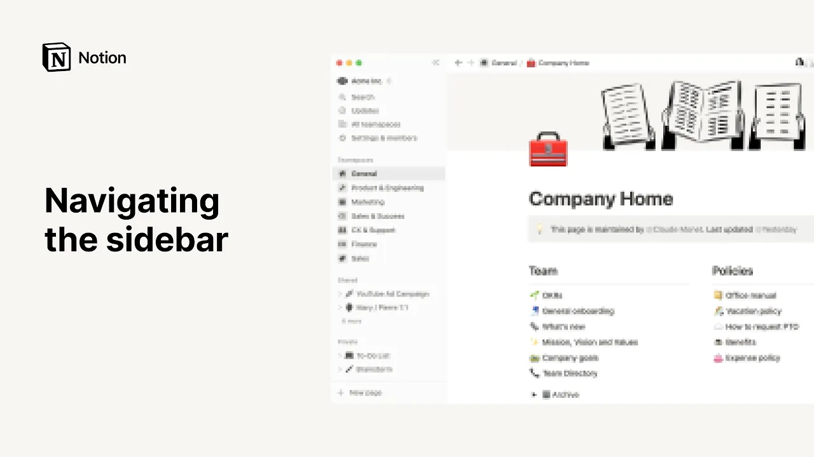

# Navigating the sidebar

**URL:** [https://www.youtube.com/watch?v=2aDk-misv58](https://www.youtube.com/watch?v=2aDk-misv58)
**Date:** 2022-08-29

## Transcript

**[Voiceover]**

"notion is a place to think write plan and find the information you need bordering the left of the app the sidebar helps you achieve all this from there you can keep your pages clean and organized but also create and manage team spaces search for and find pages quickly and adjust your workspace settings we'll show you all the tips"

"and tricks to navigate the central part of notion in a snap leaving you more time to focus on what matters first know that your sidebar can be hidden at all times for better focus by clicking on these arrows pointing to the left hiding the sidebar can be really helpful to minimize distractions during focused work to open your sidebar"

"again click on the hamburger menu at the top left of your screen amongst other things the sidebar is where you go to access pages in notion those pages can be separated into the following sections team spaces shared and private when you're sharing a workspace with multiple people these sections help you organize content by permission level the favorites section"

"showcases all the pages you yourself pinned as favorite this allows you to keep the pages you use on a regular basis top of mind and access them in one click to mark a page's favorite just click on their start icon at the top right undo this action by hitting the star again and this will automatically retrieve the page"

"from this section team spaces are home for different teams important notes docs and tasks in this case the workspace owner added all acme members to this general team space by default hence everyone has access to this array of pages that fall within general what's more you can host pages inside a notion page and host more pages inside those"

"pages as well infinitely click on the arrow next to any teamspace page to see the pages that are nested within them for context we refer to the main pages of a team space the ones that appear with no indent as top level pages while all others are deemed sub pages click on the plus sign next to a team"

"space's name to add a top level page and click on the plus sign next to a top level page's name to add a sub page within it for a more streamlined sidebar you may click on a teamspace's name to hide all the pages within them the shared section showcases pages that are shared with you or that you yourself"

"have shared with individual people or groups if you're not a member of the team space where page is located said page will show up in the shared section typically pages in the shared section are shared with a small number of people as an example you could be sharing a page that is work in progress with only two or"

"three close collaborators like one-to-one notes shared with your manager the private section of the sidebar is for your own usage like your personal to-do list or brainstorm page it's where you can go to think draft out your thoughts or plan those pages can remain private forever or you can decide to share them with specific individuals team spaces or"

"everyone there are more things you can achieve with the notion sidebar for one search allows you to look for any page in your workspace when you first open it you'll find your recent pages here and you can use advanced filters and sorts to find exactly what you're looking for updates is where you can stay up to date on"

"everything that's happening in your workspace this is where you'll be notified when your colleagues mention you on a page or a task or when someone invites you to view a page more detail on this on the reminders and mentions video you'll also find an exhaustive list of updates for pages that you're following in the following tab updates across"

"the entire workspace in the all tab and the ones you've archived in archived moving down the sidebar settings and members is where you'll find the tools to customize your notion experience even further for example you can change your account information notifications and settings as well as language and region if you're a workspace owner you'll be able to alter"

"more decisive aspects of the workspace such as the domain name teamspace settings workspace members plans security or integrations as this notion for admins video explains in great length at the bottom of your sidebar this new page button opens a pop-up to add a new page to your workspace you may use one of our templates or click on this"

"import button to bring in content from tools like evernote asana trello and more notions trash button acts like kind of an archive where you can view and recover deleted content you can drag any page into the trash to delete it but you can also search here to quickly filter the results use this button to restore a deleted page"

"or this one to delete it permanently if for now you're using notion by yourself you should be all set if you're using notion with a team the rest of this video will explain how you can navigate join and create team spaces now let's go to all team spaces located towards the top of the sidebar this is where you"

"can view as well as find every existing team space in your notion workspace at the top you'll find a list of the team spaces you've already joined all other existing team spaces that you haven't joined yet but are allowed to join will appear below scroll down to see them all or use the search bar to look one up"

"you can use this section to organize and declutter your sidebar to join a team space simply hover your mouse over its name then click on join to leave a team space click on the three dot menu next to its name and select leave team space back in the sidebar you'll also notice three dot menus when you hover over"

"each teamspace a dropdown of actions will appear you may access the teamspace's settings add new members if permitted leave the team space or archive the team space if you hover over a page within a team space you'll also find a three-dot menu depending on your level of access to the page you could be given the option to delete"

"the page add it to the favorites section duplicate it as well as copy the link to the page should you share it with someone else you can also rename the page from here or move it to a different team space or to the private section of your sidebar remember that changes to a page will affect everyone who has"

"access to it finally especially if the page is content heavy you could decide to turn it into a team space of its own by clicking here on the other hand you can reorder team spaces freely in your sidebar without having these changes affect the sidebar of your peers just drag a page or team space with your mouse and"

"drop it wherever you'd like them to appear finally as a notion user you might be a member of more than one workspace to switch between one workspace and another simply click on your workspace name and select the one you'd like to access from the dropdown should you have another notion account you also have the option to add another"

"account here and log out of notion by clicking log out all lesson completed as you now understand the sidebar is your navigation board to all things notion and the more you understand its inner workings the more time you'll have to focus on the work that matters to you thanks for watching [Music]"

