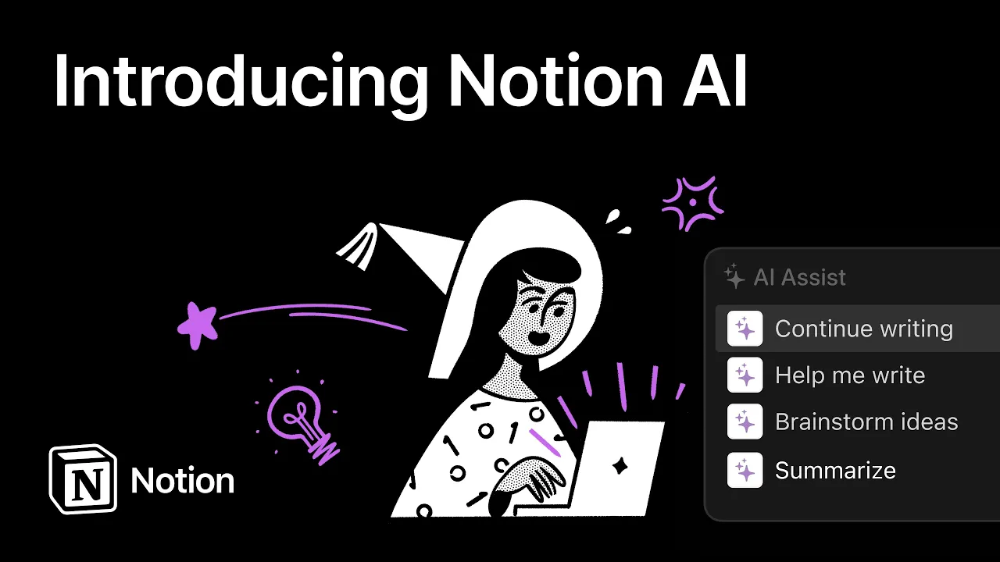

# Introducing Notion AI

**URL:** [https://www.youtube.com/watch?v=FElBbgnNtVA](https://www.youtube.com/watch?v=FElBbgnNtVA)
**Date:** 2022-11-16

## Transcript

**[Voiceover]**

"Today we're introducing Notion AI Which brings the power of artificial intelligence directly into your Notion workspace. Let's say we're writing a blog post to introduce Notion AI. It's as simple as asking AI assist for help and clicking generate post. Next, just sit back and watch as artificial intelligence completes your first draft. Notion AI is also super talented at"

"helping you brainstorm whenever you get stuck. In this case, let's brainstorm ideas for promoting our new feature. Looks great. Notion AI likes to think big, but it's also good at smaller things, like fixing spelling and grammar. Perfect. Need help with translation? Watch Notion AI translate in real time. Magic. The truth is sometimes we all just get stuck. And"

"in those cases Notion AI can help you write. Just ask it. Okay... a little bit bold but we'll take it."

