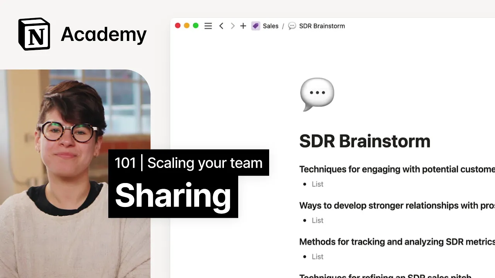

# Share pages with teammates or the web

**URL:** [https://www.youtube.com/watch?v=k85zURD9DEo](https://www.youtube.com/watch?v=k85zURD9DEo)
**Date:** 2023-02-01

## Transcript

**[Voiceover]**

"[Music] foreign we'll show you how to share pages with individuals groups and the World Wide Web we'll demonstrate this by sharing a one-on-one note stock with a manager once you've created all your content you're probably going to want to share it with others as you may have noticed pages are organized on the sidebar into three sections team spaces"

"shared and private these are where all of your pages will be housed depending on your current workspace architecture you may see just one or all of these sections generally speaking we encourage people to keep their sidebar minimal you should only join the team spaces that are relevant to you and try to Nest Pages inside other Pages as much"

"as you can to keep related information together we'll get more into team spaces in the next video as you can see there are only about 10 pages in my sidebar but those don't represent every single page in my workspace other pages are nested inside of these like so in notion you can Nest Pages inside Pages infinitely for these"

"more hidden nested pages that you want to be able to access easily think a project plan you're actively working on you can pin favorites to create a fourth section at the top the best practice is to be selective with favorites favorite Pages you use frequently or favorite relevant project pages and unfavorite them when the project wraps if you're"

"working in a workspace alone you would just see one section and maybe favorites since shared and private won't mean anything different to you workspace owners and membership admins can add members in settings here you might not see this panel if you're just a workspace member we'll get more into these role types later on but keep in mind that"

"members can join team spaces and access General workspace content usually every team member is added to a notion workspace as a member in these cases those workspace admin roles along with their special privileges are reserved for people managers or it admins let's go ahead and learn how page sharing works and talk about some best practices when it comes"

"to sharing starting with when should you share with one person when you share a doc with just one person it will populate in the shared section of both of your sidebars this is useful for brainstorms private meetings HR discussions or generally speaking anything you wouldn't be comfortable with your whole team seeing to share with one person use the"

"share tab add an email choose an access level optionally add a note and click invite similarly when should you share with your team anything that you create in or move into the general team space section can be accessed by all workspace members pages in other team spaces are shared to those corresponding team space members these sections are useful"

"for promoting transparency and keeping everyone on the same page examples of things we commonly see in team spaces are meeting notes documentation project management road maps Etc generally speaking we suggest you default to creating pages in a relevant team space unless there's a reason not to do so finally when should you share with the public we see a"

"lot of people create public notion pages to function as makeshift websites things like startup job postings resources for new employees or even landing pages for special promotions can all be shared with notion's public pages when you share something with the public you'll need to toggle share to web on and there are more granular permission levels that you can"

"set here like search engine indexing and editing access based on your use case for websites you'll want to turn search engine indexing on and likely turn everything else off you may also want to lock the page which will prevent any accidental edits later on we'll talk more about how admins can structure team spaces and change settings to prevent"

"accidental sharing but for now let's think through a more common notion use case one-on-one notes foreign for any regularly scheduled meeting it can be helpful to keep a log of discussion topics and action items this helps keep both parties organized and gives you space to put random thoughts throughout the week to maximize time together one-on-ones are also a"

"good time for managers and direct reports to talk about personal or sensitive information which is why they make a great case to learn about sharing we probably wouldn't want to create a one-on-one notes log inside of a public area due to the nature of the content for obvious reasons it can't be private so it needs to land in"

"the shared section to share a page with just a subset of your organization you'll want to First create it as a private page I'm going to pull in Notions quick one-on-one meeting notes template here just so we have something to work with and populate it with some sample meetings for this we can call it Monica and Elia one-on-one"

"once it's created I can use the share button to give Monica access to everything here then both of us can add pages for weekly one-on-ones if at any point a discussion from the one-on-one needed to be shared or escalated to another team member myself or Monica could share just a single meeting's worth of notes and it would show"

"up in the shared section of the third parties sidebar that's it for now [Music]"

