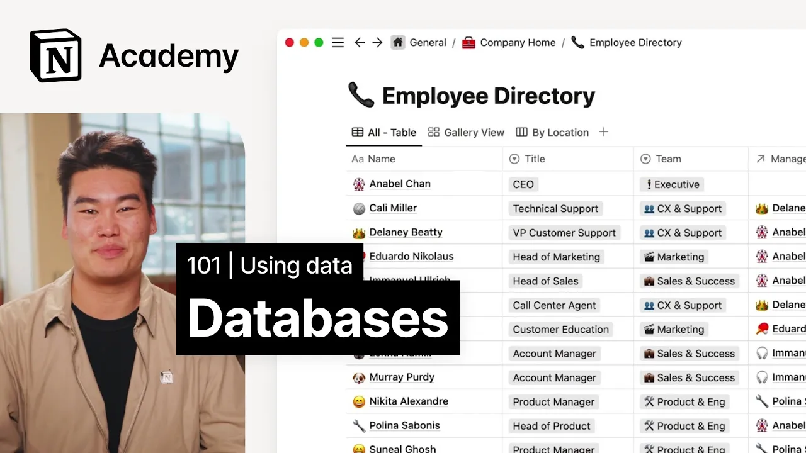

# Getting to know databases in Notion

**URL:** [https://www.youtube.com/watch?v=WAjGg5ubA8I](https://www.youtube.com/watch?v=WAjGg5ubA8I)
**Date:** 2023-02-02

## Transcript

**[Voiceover]**

"[Music] foreign we're going to talk about a new block type databases databases are one of the most powerful notion features and will take your notion game to the next level in this video we'll cover how to create databases and add Properties by building out a Content calendar until this point we've just been working with basic blocks and media"

"so let's take a look at an example database at first glance a database in notion might look like something you've probably seen before a spreadsheet however notion databases are much more powerful than your typical two-dimensional spreadsheet over the next couple of videos we'll take a tour of databases in notion and explore that power starting with the name property"

"this property is an identifier for each database entry it's pretty similar to a page title and describes what you expect to find in that row so in our example every row is a person that works at Acme Inc a pretty natural identifier one pro tip about the name property it is the only property in a database that notion"

"requires you to have others can be deleted or they're type modified this will be good to know as you start to build your own databases after each name we see columns with descriptions of the person these columns are also called properties you'll hear me use the terms interchangeably here you can see a number of different properties that describe"

"the person like their title team manager LinkedIn profile email and more you might also notice that these columns look richer than your traditional spreadsheet with formatting color and interactivity unlike a spreadsheet notion databases require each column to have a type literally a data type which you can sort of think of like block types for example this name column"

"is a special name type the team and location columns are tags the start date is a date and the LinkedIn profile is a URL this means that they can be uniquely formatted and displayed in different layouts which we'll get into soon the last thing that I want to show here is that each row in a database actually opens"

"up to its own page literally everything that we've learned up to this point can be used inside of a database moving on from the tour let's go ahead and create our own database in notion we'll build out the framework of a Content calendar for a marketing team [Music] just like any other block type in notion a database can"

"be added with the slash command or the plus sign you may notice a couple of things here databases are a category rather than a block type instead you'll see several types of view layouts for databases for now we'll stay focused on the familiar table layout you'll also notice that unlike other block types databases can exist in line on"

"a page or open up to their own page for now we'll build an inline database in this page which allows us to add additional context around it if we so choose after adding our inline table we'll give it a name like upcoming blog posts then we can go ahead and start adding entries to the database maybe there's a"

"blog post about our API one about our latest funding round and a customer story to add more entries we can use this new button so let's go ahead and add cheers to our first one million users tables come with a default Select Property called tag which we can delete or rename in this case we might want to use"

"tags to identify blog posts by type engineering thought leadership General marketing once a tag is used once it can be reused to reference another item in the database we can add any other kind of property by clicking this plus sign again remember that we need to designate the type of property here if we want to identify the blog"

"post author it would be helpful to add a person property if we want to add a publish date a date property and so on databases unlock an entirely new world of notion usage and power the creation of some incredibly complex tools built on notion this is just the beginning [Music]"

