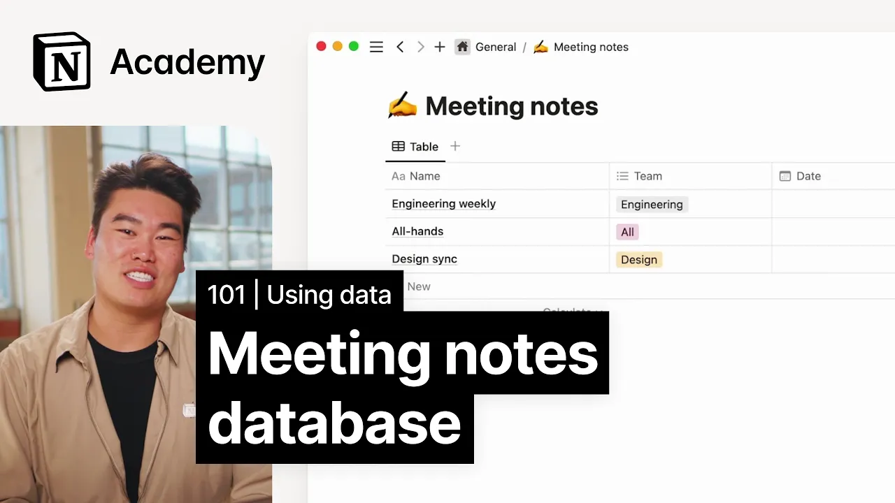

# How to build a meeting notes database

**URL:** [https://www.youtube.com/watch?v=TxIrtrP3UfU](https://www.youtube.com/watch?v=TxIrtrP3UfU)
**Date:** 2023-02-02

## Transcript

**[Voiceover]**

"[Music] foreign workspace is with databases so let's build a meeting notes database together without databases it's possible to amass huge collections of individual pages of similar types and you lose out on the ability to tag sort and filter them using a database for meeting notes is a great way to keep everything in one place and organize all of"

"it properties help you identify meeting date location host and more so it becomes really easy to sort and filter information to find just what you need we suggest that whenever possible your entire company or Department shares the same meeting notes database you can utilize views with filters whenever you need to see a smaller subsection of notes but this"

"way you can also get a high level overview without having to combine multiple databases this is actually how we run our internal node system at notion and it works great to build out this database let's first create a new page in the general team space putting it in the general team space ensures that everyone will have access to"

"it individual users and teams will be able to pull this data into their own team spaces and Pages which helps to increase transparency and prevent information silos just a heads up in this example we're going to be focused more on the database design and build than the actual content Within we'll start with giving our database a title and"

"an icon let's call it meeting notes and add a writing hand emoji if I click on this row it'll open up a blank page that I can edit just like how we've been editing all other pages in notion that's what makes it useful for storing our meeting note content the general idea here is that each horizontal row will"

"be a meeting each vertical column will categorize that meeting and its different properties the date of the meeting the team members involved and more I'll add some fictitious meetings to work with engineering weekly all hands and design sync next up we'll need to decide what properties we want to add these will be available to categorize each meeting within"

"the company and our how will be able to sort filter group and otherwise organize our meeting notes you'll notice that by default there is a multi-select property called Tags we can use this to add any category for example what teams had the meeting so let's rename the property from tags to teams we can then add one or multiple"

"teams here like engineering design marketing and remove the ones we don't need when it comes to adding other properties we'll use this plus sign here we'll give the new property a type and decide its name one important thing to classify about a meeting is when it took place so we can add a property select the type date and"

"name it date we'll also want to know who attended these meetings so we can follow the same process to add a person property with the name attendees finally it might be helpful to add a multi-select type property to distinguish between different kinds of meetings like all hands daily stand-ups or weekly syncs as your company grows and Records more"

"and more meetings in notion this can become a really fantastic running record for remembering every decision and conversation that's happened over the years [Music]"

