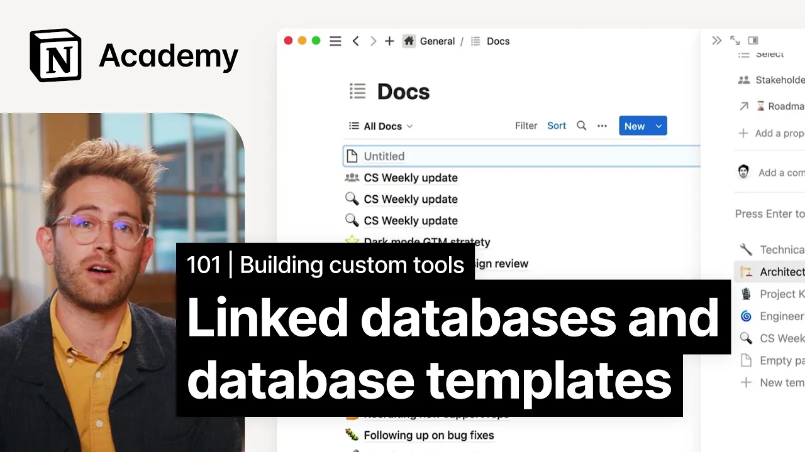

# Improve database usage with linked views and custom templates

**URL:** [https://www.youtube.com/watch?v=fUxm1G3FePg](https://www.youtube.com/watch?v=fUxm1G3FePg)
**Date:** 2023-02-03

## Transcript

**[Voiceover]**

"foreign we'll consider how to use data sources and database templates across your workspace to stay more connected to your team every time you create a new database or view you'll be given the option to select an existing data source from your workspace we recommend using just a few core databases for day-to-day operations of your work and life rather"

"than a whole bunch of smaller databases using properties to differentiate content this helps you stay more organized at scale for teams meeting notes tasks projects and docs tend to be a good place to start then when you want to add a reference or add that information somewhere else in your workspace you simply make a new view of the"

"existing database everything pulls from the same underlying information so an update in one location persists wherever you view that information another advantage to reusing data sources is that you can use database templates to softly enforce healthy ways of working most databases contain the same types of pages created over and over again think of weekly meeting notes bug reports"

"or design specs to make this easy database templates let you define and replicate certain page structures with just one click let's zoom into the example of docs with a traditional word processor you're always starting with a blank document and creating structures you go typically this means that no two documents look or feel the same when you go and"

"create a new document in a database in notion you're prompted to choose from a set of templates set up by your administrators or your peers you can set these up to yourself too but we'll get to that later in this data source you might have a product requirement doc or a PRD used by Engineers a campaign proposal for"

"marketers and a standard operating procedure for HR and people functions these can be configured to make sure that the necessary information is always there taking some of the guesswork away from document creators templates combined with link views help your org feel structured and streamlined you don't have to go back to look at this massive database ever unless you"

"want to you just create your view and context of whatever project you're working on click the relevant template and get down to business let's go ahead and try that together your team uses a meeting notes table to keep track of all company meetings but there might be dozens if not hundreds of entries every day let's just say you're"

"working on a big cross-functional project and want to surface just meetings tagged with your project name in this case you'll want to add a new database and instead of clicking new data source like we've done in past lessons you'll select meeting notes and then create your view like usual for this dark mode launch page we'll want to add"

"a filter to only show notes with the appropriate tag anyone with access to your project page and the original database can see this View and change the view without affecting the original database but any changes you make to the data itself that is Properties or Pages inside the database will change for everyone everywhere that this data exists so"

"for example we can add a new meeting here fill it out with all the relevant information and see that the meeting has been captured in our company-wide database alongside other meetings what's more as you may have noticed when we added a meeting note page from this view it gets automatically populated with those properties it's filtered on you can"

"really go nuts here and combine multiple data sources within one database block so we might have meeting notes about the project in one Tab and docs in another you can add these tabs using the exact same process as the original database view just click new view select your data source add your filters and voila if your organization is"

"already using notion there might be tons of databases that exist as a contributor you could consider setting up a personal page with a view of this data for all documents tagged with your team or that were originally created by you this helps keep your focus on what matters while maintaining organization across your company [Music]"

