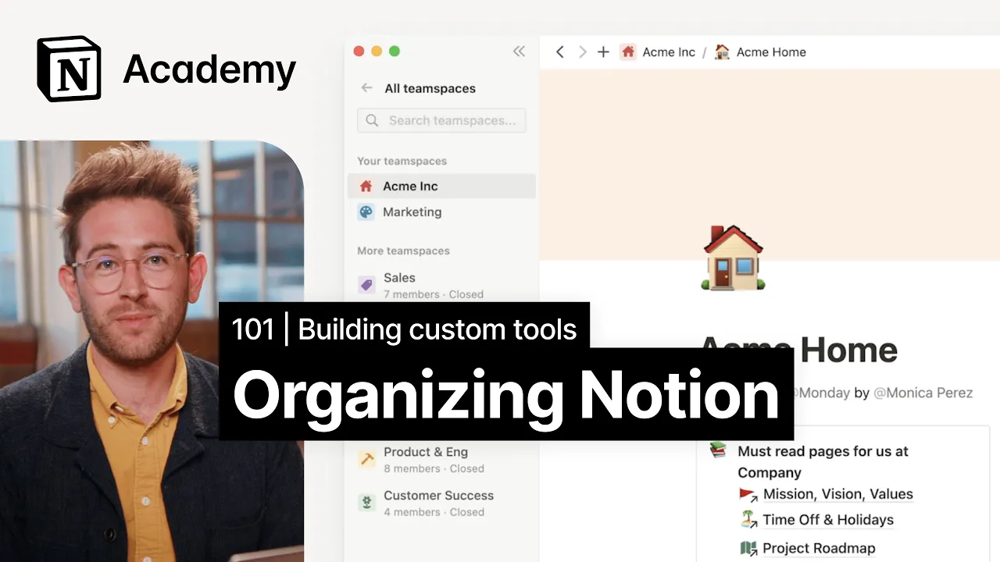

# Best practices for an organized workspace

**URL:** [https://www.youtube.com/watch?v=cVt-Qrx5mFc](https://www.youtube.com/watch?v=cVt-Qrx5mFc)
**Date:** 2023-02-03

## Transcript

**[Voiceover]**

"foreign we'll explore ways that teams have implemented notion at scale and discern key principles for an organized workspace without a little pruning no matter how beautiful the flowers every Garden can become overgrown notion administrators and members alike can tend to the sidebar to keep the workspace clean and beautiful for everyone you wouldn't let your physical office space Stay"

"littered with trash so you shouldn't let your notion space get out of hand either in our intro to sidebar video we discuss how individual team members can curate their view of the workspace by joining relevant team spaces sharing pages and creating a personal dashboard if you're considering how to create this level of organization at your company this lesson"

"is for you you can create team spaces for each major function at your company for individuals to browse and join at notion we have a general team space and a team space for each big team marketing people product sales and success legal finance and security within each team space sub teams have their own home pages that exist as"

"top level pages in the sidebar these top level pages are important because they allow folks to browse and find content more easily and unlike a traditional folder and file structure you can add text alongside pages to further help your team know where to go companies should align on three to five key databases like meeting notes docs and tasks"

"to run most of their day-to-day work we'll talk a lot about the power of databases in these lessons and think you'll come to agree that they're very important to a clean and organized workspace having a few key databases full of Rich properties like tags and other metadata can help to keep information organized finally organized workspaces keep all important"

"resources like key databases and docs in a general team space I already mentioned Notions General team space and every workspace is required to have one default team space but what should be kept here anything a new team member would need regardless of their spot in the company Mission Vision and values benefits information a new hire manual or office"

"information [Music] let's look at two examples of notion workspaces and compare and contrast there isn't necessarily a wrong way to organize your workspace but keeping a few best practices in mind will help your team feel calm and cozy whether they're opening notion for the first time or the 500th time our first example is one with too many top"

"level Pages everything is a top level page with no rationale or consideration of hierarchy this is one of the number one mistakes we see large teams making and there's a few ways to prevent it for starters if you're on an Enterprise plan workspace teamspace owners can prevent members from editing top level sections of the sidebar you can also"

"consider creating a top level page for lost pages to be tidied pages that need a home or whatever works best for you and your team even the most organized people have a junk drawer somewhere in their home you can also take time to educate peers on notion's nested Pages it's not entirely uncommon for people to create top level"

"Pages without realizing what they've done or that anyone in their team space can see it if you're using notion and daily operations consider adding some of these best practices to your new higher onboarding you'll notice a few other things here that just don't feel great lack of consistent iconography use pages that serve competing purposes like docs versus engineering"

"Docs poor use of databases and way too many shared pages while none of these are hugely significant they might make notion less enjoyable to use by contrast let's look at a more polished space this workspace has team spaces for different functional areas within the company in the general team space they've neatly laid out the company's five key databases"

"and how to use each one within the product and engineering team space headings help direct a reader's attention to the right place and each sub-team has their own homepage that they've customized to suit their needs to a new hire this workspace is far more welcoming and will help everyone settle into their working day quickly and without friction to"

"summarize the best practices learned here today number one be intentional about how you use team spaces number two give each sub team their own home page number three Keep company-wide information in the general team space and number four add Flair and Foster Community with custom icons cover images and more go ahead and head back to your notion space"

"and consider any structure that you'd like to create to keep your team tidier [Music]"

