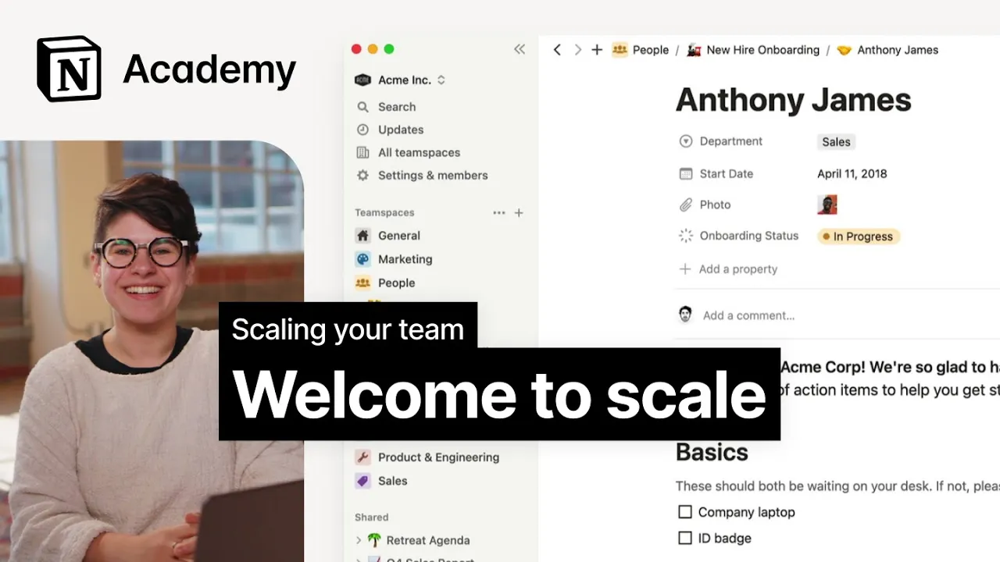

# Scaling your team: Introduction and everything you’ll learn in this course

**URL:** [https://www.youtube.com/watch?v=YwgOM4l4UHM](https://www.youtube.com/watch?v=YwgOM4l4UHM)
**Date:** 2023-02-06

## Transcript

**[Voiceover]**

"hi Welcome to our course on scaling your team [Music] in this course we'll go deep into sharing and structure within notion we'll start by getting to know the sidebar a bit better and we'll work our way up to fully customized permissions and team spaces my name is Elia I'm a customer success program manager here at notion which means"

"I've seen some of the largest deployments of notion and I spend most of my day thinking about organization and security at scale both within notion and for our customers many times I see small teams start out with notion and then expand it to larger departments or even whole companies due to its stickiness and ease of collaboration this is"

"fantastic for transparency and connectivity but it requires some intentional thought how do you ensure that team members have access to the right level of information to do their best work how do you keep private information secure how do you find that important document from two years back that now you need to update before onboarding a new team member"

"after completing this course you'll be able to explain everything that has to do with scaling a team in notion from Team spaces and sidebar management to Notions somewhat complex permission model to database templates [Music] in this concept based course we won't go over every single feature in notion so while we'll work our way up to the more complex"

"setups I might be using features Without Really introducing them first so this course is best if you're already familiar with Concepts like blocks and databases in notion if you're looking for something more basic or sequential check out our 101 introduction course it takes you from writing a page all the way through editing a database by the end of"

"this course combined with that foundational Knowledge from other courses and your own notion expertise you should feel prepared to architect a knowledge base for a large team [Music] to get there we'll start by exploring the sidebar and Page sharing we'll build out an office manual and then dive into database templates and advanced database properties to build a scaled"

"system for regular newsletters and updates finally we'll dive into some really granular details on teamspace implementation and inherited permissions as with all of our courses I suggest have notion open be ready to build share and scale alongside us I can't wait to help you help your team let's Dive In foreign"

