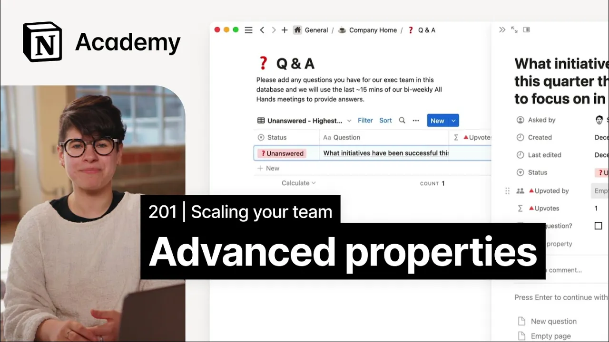

# Using relations, rollups, and formulas to organize content

**URL:** [https://www.youtube.com/watch?v=7StuNR-TUOk](https://www.youtube.com/watch?v=7StuNR-TUOk)
**Date:** 2023-02-07

## Transcript

**[Voiceover]**

"foreign we'll cover how to create views of databases using Advanced properties and highlight some helpful use cases for those Advanced properties Advanced database properties automatically calculate information about a database entry based on predetermined configurations set by the database architect whether that's you or someone else understanding Advanced properties can help you to slice and dice your content in helpful"

"ways when you're working on a small team tags and other properties are often enough to manage content but when you have hundreds of people working off the same database it can become difficult to find the information that you need without a more robust system Advanced properties allow you to create more layers of organization and since they're largely automated"

"you can better understand your database without any extra work today we'll look at three types of advanced properties relations which let you link pages in one database to pages in another formulas which let you perform calculations or trigger actions based on other properties in a database and metadata which captures behind the scenes information about a database item including"

"when it was created and who it was created by when relations are configured you'll be able to click into a property and view a list of database items on a related database you'll also be able to view additional information about the related database through rollups formulas are one of the most powerful features of notion I've seen people build"

"functioning interactive games with formulas and the possibilities are truly endless in most contexts though they're useful for simple operations like calculating a number based on two other properties or creating an upvote mechanism in something like a q a database metadata is most important when it comes to administering a large team's notion workspace with properties like last edited time"

"and last edited by it's easy to see who is making changes in your company's knowledge base and avoid stale content [Music] to add Advanced properties open an existing database just like adding any other property click the plus sign in the top right corner to find the advanced properties simply scroll down and you'll see everything that we just discussed"

"formulas relations Roll-Ups created time and buy and last edited time and by let's go ahead and add a relation property to our meeting notes database and play around with what we can do here let's relate our meeting notes to docs your team may already have this but if you're building notion out from scratch this is a great thing"

"to do it allows you to get a more comprehensive picture of what your team is talking about in a given meeting when we go to add the relation we have a couple of options limiting a relation means that each row in this database can only be related to one row in another database this is good when you have"

"one-to-one relations where it wouldn't make sense for there to be more than one item related to the new item for example you wouldn't have a task that is related to multiple projects so you could limit that relation to just one page in this case however multiple docs could be referenced in one meeting so we'll have no limit we"

"also have the option to show this property on the docs database as you can see in the preview that adds a property to the docs database as well which shows the meeting notes in which that doc was discussed in this case it's a great thing to do you can decide based on the relation that you're adding whether it"

"makes sense for you with this new property I'm able to view all of the docs in my docs database and relate them to my meeting notes for example if at this marketing sync we talked about the customer success Playbook I can link that document here and I can view the customer success Playbook without leaving the meeting notes database"

"I can also add a roll up to this database which allows me to view additional information about my related documents so for example I'll add a roll up and select the docs relation now I can choose whichever property it is from the related docs database that I want to highlight here I'll show the created by Advanced Property from"

"the docs database and I'll name the rollup doc author it'll give me a clear view on my meeting notes database of which document authors are contributing the most to meetings at my company consider how advanced database properties could make it easier to administer your team's workspace foreign"

