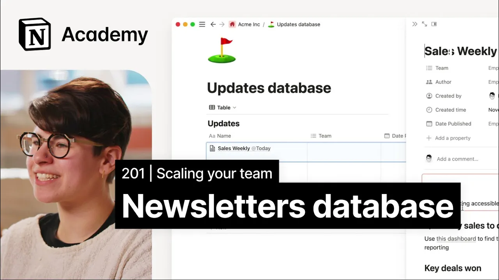

# How to build a database for company updates

**URL:** [https://www.youtube.com/watch?v=oEvr-aZ-NcI](https://www.youtube.com/watch?v=oEvr-aZ-NcI)
**Date:** 2023-02-07

## Transcript

**[Voiceover]**

"foreign [Music] we'll create a sales weekly Digest the goal of the digest is to create a central Hub where cross-functional Partners can go to learn about everything the sales team is working on deals One deals lost and asks from the team without sorting through the specific details of their meeting notes or their CRM there's a few ways to"

"approach this you could add these into the docs database to be housed alongside other living documents Pros to this approach include searchability and organization since everything is in a single database on the other hand depending on how the docs database is constructed some properties like Acme's stakeholders might not quite align you may choose to create a new database"

"for all teams to add updates to which is what we'll do here I'll skip that process for now but if you want to refresher on creating databases check out this video our new database boasts several properties a person property to denote author a multi-select property for teams and a date published option let's add a couple of advanced properties"

"here specifically created by and created time while this information is always captured under the hood adding them as distinct properties helps organize this collection of updates further especially if a teammate forgets to add those properties themselves next let's create a template for a sales digest since this updates database has been constructed for the whole company eventually we'd expect"

"many different teams to populate their own update templates like an engineering announcements bulletin or an all-company announcements monthly recall that to create a database template in notion you can use the blue arrow to the right of the new page button here we'll create a new template and start to fill it out with a skeleton outline of a sales"

"Digest as usual we can start by giving this a name and filling out the properties one nice thing about database templates is that you can use the at today mention dynamically so that today will populate with that day's date when you're using the template this combined with Advanced database properties like date created creates a consistent naming structure and"

"makes updates easy to find in the body of the template we'll simply add the sections that are cross-functional Partners want us to report on I can improve this by adding instructions to the person who's filling this out at the top of the dock you might use a synced block to emphasize the mission of the sales team to make"

"tool making accessible to Enterprise teams borrowed from the team charter like all synced blocks this will automatically update with any changes where needed you can add details with toggles and callouts pages that you want to keep top of mind like the Acme CRM so teammates can self-serve details about specific accounts and maybe that full sales team charter too"

"you could take this further by adding more linked database views link previews and automations to import this information automatically but we'll save that for another time the goal of this digest is to create a central Hub where cross-functional Partners can go to learn about what the sales team is working on deals One deals lost and any asks from"

"the team without sorting through the nitty-gritty details of their meeting notes or CRM updates you could use this database or one like it to store all sorts of updates for your team in one centralized place you could even take it a step further by connecting it to slack or email for seamless communication foreign"

