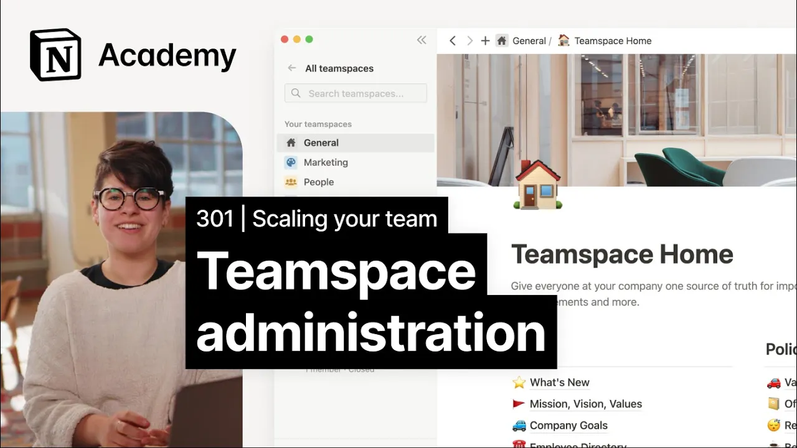

# Creating teamspaces for your organization

**URL:** [https://www.youtube.com/watch?v=n-ZpBnOgKww](https://www.youtube.com/watch?v=n-ZpBnOgKww)
**Date:** 2023-02-08

## Transcript

**[Voiceover]**

"[Music] foreign we'll compare and contrast different methods of sidebar organization so that you can architect a thoughtfully crafted workspace for your company's needs team spaces are notion's solution to complicated permission and provisioning needs smaller companies may only need one or two team spaces to feel organized and connected but larger ones may opt to have a variety of Team"

"spaces organized in a variety of ways team spaces function a lot like slack channels they can be customized depending on your company's working style and needs let's take a look at how to create a team space and we'll talk about some best practices to create a team space click on the plus button to the right of the teamspaces"

"label in your sidebar or go to all team spaces and click new teamspace from here give your team space a name a description and choose an icon then you'll choose the permission settings for your team space open closed or private and select create team space teamspace permissions dictate how workspace members can join a team space open Team spaces"

"means anyone can join closed team spaces mean anyone can see that the team space exists but they can only join with an invitation private team spaces mean that only team space members will be able to see that it exists by default teamspaces give content access to workspace members in the ways you would expect close team spaces won't allow"

"workspace members to view Pages within them while open Team spaces will both workspace joinability and Page viewership can be changed in settings later on after creating a team space you'll be prompted to add workspace members simply type their email or their name into the text box and choose whether to add them as members or team space owners team"

"space owners will be able to change things like team space settings and security while members will have a lower level of access to add everyone in your workspace automatically to your team space you can toggle on make default team space most likely you'll only need one default teamspace and we would recommend no more than three even for a"

"large workspace because too many default teamspaces can contribute to unnecessary clutter as a team space owner you'll be able to revisit these settings at any time in the teamspace settings menu here you can also add members and change page access for team space owners team space members and workspace members if you're responsible for creating team spaces you'll have"

"a few decisions to make these decisions will help you with proper team space implementation I'll highlight a few important rules for well-organized team spaces when it comes to top level pages each team space should include a home page and top level Pages for sub teams plus any important database views or crucial knowledge based Pages where they exist other"

"pages should be nested inside of these as subpages to Foster greater transparency and to reduce the management overhead for team space owners we generally recommend all team spaces should be open by default though there are a few cases where closed and private team spaces make sense closed team spaces are useful when you need some control over who can"

"view content within the team space for example you can create a closed team space for all managers in your company private team spaces are helpful when a group is working on something sensitive something you need a degree of privacy or anonymity for example HR might use a private team space for collecting employee feedback or accounting might use a"

"private team space when compensation and benefits are being discussed let's go ahead and look at two real examples of Team space implementation we'll compare and contrast according to the rules that we just learned again there isn't necessarily one right way to implement team spaces but try to keep in mind these best practices they're going to help your organization"

"scale in a way that works best for your team our first example showcases a team space for every Department it's very minimal and probably only allows team space creation by admins this allows for a lot of visibility across the org but it's easier for team spaces to get messy and disorganized when you're curating so much content in the"

"same place in example 2 we see a bunch of Team spaces based on projects with one team space for General documents and a knowledge base with team-based subpages that all company members are part of this allows for a more personalized sidebar for individual team members however it also promotes less visibility across projects that you're not part of this"

"may be better suited for a very very large organization where most work is Project based as opposed to encompassing a larger team finally let's look at an example of Team spaces that were created haphazardly this one has one called epd and another one called epdwiki go to market and one for the content team and many teams don't have"

"a space at all this was probably quick to implement and it'll work in the short term but without a lot of thought going into the structure of the team spaces you can see how this would quickly become confusing for new and existing team members as it's extremely unclear where specific information lives there are simply too many competing options"

"whether you're architecting your space from scratch or refactoring an existing workspace to feel more manageable consider how you might use teamspaces to make sure every individual has access to exactly the pages they need to get their job done effectively foreign"

