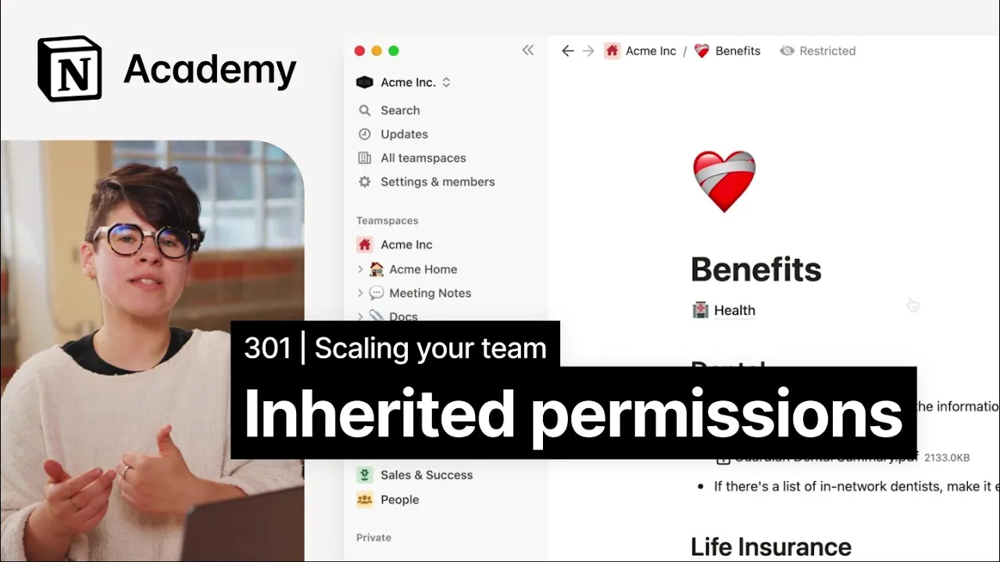

# How page access gets passed down

**URL:** [https://www.youtube.com/watch?v=pG_Ru8P3fzk](https://www.youtube.com/watch?v=pG_Ru8P3fzk)
**Date:** 2023-02-08

## Transcript

**[Voiceover]**

"foreign [Music] we'll explain page sharing and permission inheritance in pages and team Spaces by creating a new benefits page in our general team space the more content you've built in notion the more you'll consider who has access to what content and what kind of access they have permission models can get fairly complex so today we'll look at some"

"guiding rules for understanding access in notion we'll mostly look at Pages because there are some nuances when it comes to synced blocks and databases we can explore those at another time when we talk about permissions we often talk in terms of a hierarchy of access the highest level of access a user can have is full access which means"

"that they can change other people's access levels and do anything with the content on the page including share it to the web the lowest level of course is no access if you're watching this video you're likely already familiar with the other options can view can comment can edit and can edit content on databases another thing we talk about"

"is the idea of parent and child Pages if you think of notion like a series of nested folders parents are the folder pages that the child pages are within and they can be nested infinitely with those definitions out of the way there's two rules that unequivocally govern permissions in notion permissions are granted and revoked on the page level"

"but inherited from parent pages and team spaces a Pages share menu can be seen as the single source of Truth the highest level of access applied to any individual user wins in other words if a user has full access via a group but only can view access via team space defaults they'll be given full access let's break those"

"down starting with the first rule permission inheritance from parent pages and team spaces we'll start at the team Space level as we just learned team space owners can set up default permissions for team space owners team space members and workspace members who don't belong to the team space if you're on an Enterprise plan groups and individuals within a"

"team space can also be given unique levels of access a top level page of a team space will default to the team spaces settings but these settings can be changed child pages will inherit permissions from their parents knowing how these default permissions are set what happens in the case of a conflict we've actually already seen examples where it"

"comes to the highest level of access winning this person is a member of the sales and success managers Group which is granted a higher level of permissions than other team space members even though they're a team space member with can edit access they'll actually have full access due to their manager group standing similarly let's consider a situation where"

"an individual's access is manually revoked via the share menu in this case even though a member went through the effort to remove this team space owner from being able to access the page they didn't change the team space owner setting so this change wouldn't actually apply in order to ensure that access was revoked for this individual they'd have"

"to change access for team space owners as well before we dive into an example I want to leave you with a word of caution in notion it is possible to remove your own access to a page we recommend individually granting yourself full access before reconfiguring page permissions in order to avoid this situation [Music] these default permissions apply every"

"time I create a new page for example I'll create a benefits page in the general team space I'll expect that all team space owners will have full access and all team space members will have edit access since this is a default team space workspace and teamspace members are the same this is great but let's say I just created"

"this page and I'm still working on it maybe I'd want to revoke access while I'm working on it to do so I'd want to change the default level of access to no access and then specifically invite the collaborators I want to share with now I can share with my manager directly and even a whole group of my peers"

"a side note on permissions any user groups should map to your company's concept of teams and levels with additional groups being created for specific projects when needed if you're on an Enterprise plan we recommend provisioning users into these groups through skim note that members of the team space without access will simply see no access instead of the name"

"of this page another way to do this would be to create the page in the private section of your sidebar then use the move to menu to move it to the team space since you changed the parent of the Page by using the move to menu the inherited permissions will change as well as you work on the guide"

"and create sub Pages these subpages will inherit permissions from the parent unless you overwrite permissions on a sub page all of the pages and their permissions will stay linked together whenever you make a change once the guide is done you can go back into the page sharing settings and Grant access back to teamspace members moving even further you"

"can add or restrict permissions with groups let's give all managers edit access then we'll give all ICS view access and finally give the HR team full access this guide is of particular interest for new hires and candidates so you may want to add guests who aren't yet part of the company to this page you can do that by"

"adding a personal email without granting access to the full team space and all of the content in it just add the personal email via the share menu and do it on the parent benefit page so they will inherit access to all of the sub Pages as well that's it on inherited permissions for many this happens behind the scenes"

"but in cases where you need to be very intentional keeping these rules in mind will help make your life easier [Music]"

