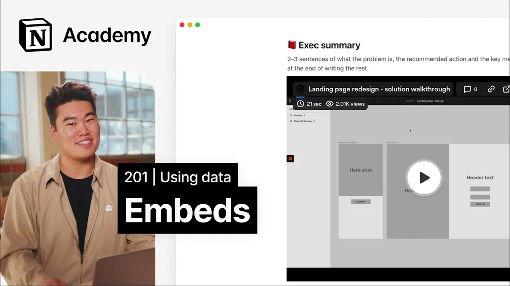

# Using embeds for more dynamic documentation

**URL:** [https://www.youtube.com/watch?v=0xdqxsg1QR4](https://www.youtube.com/watch?v=0xdqxsg1QR4)
**Date:** 2023-02-14

## Transcript

**[Voiceover]**

"[Music] foreign we'll discuss embeds in notion and use embedded video content to level up otherwise static documentation do you know that the average company uses 88 tools to get work done that number only Rises as a company gets larger using this many tools is costly teammates are switching context too often and likely losing information managers have a hard"

"time seeing their teams work when it's scattered across so many platforms you need a One-Stop shop to centralize content and help you understand what's going on at your company notion offers a solution to that with embeds let's go back to Computing fundamentals for a sec the embed tag exists in HTML as a container for an external resource it's"

"a way to reference information somewhere else on the web and pull that in line to your web page as complicated as that sounds it is commonplace on the web today and it's surely something you see all the time we embed YouTube videos and emails and regularly interact with embedded elements on other people's websites like embedded tweets or Maps"

"or even Facebook reviews embeds differentiate notion from a lot of other document editors but if you're from the Myspace generation like me they should feel pretty intuitive however instead of just embedding your favorite music videos which you can totally do you can also embed information from apps like Google Maps figma codepen Loom Miro Whimsical and more there are"

"over 500 different embed types in notion with more added all the time for most common embed types in notion you can just paste the link of that resource on the web and select the embed file option for example to embed a Google map we could just copy this URL paste into notion and select embed Google Map similarly to"

"embed a YouTube video I'll just copy paste and embed embeds require individual access to a file or for that file to be publicly available in order for you to see it in notion for example without embeds if you were sharing a mirror file you'd probably include a screenshot or a hyperlink in your main dock a screenshot is static"

"though so every single time you'd update your mirror file you have to go back and change the screenshot in the dock on the flip side a hyperlink leads to up-to-date content but viewers would have to navigate out of your dock to view the diagram and all that great context living alongside the image would be lost at the end"

"of the day embeds are a fairly simple concept but one with outsized impact on your personal and team productivity let's look at some more tangible applications of embeds by sprucing up a project plan in notion foreign this basic project plan for a landing page redesign with text and uploaded images it would quickly grow stagnant these kinds of project"

"plans are only good for a moment in time snapshot of data and updates as soon as designers update the mocks or another person submits feedback this project plan is lacking important information with the project this big that could happen within hours of the dock being created and sent out so how can we use embeds to make this dock"

"more dynamic first embed a loom video that explains context more dynamically than the text could we'll simply copy the link from Loom paste it into notion and select paste as embed next we can replace the static screenshot with an embedded figma mock that will update whenever designs change this could also be done through link previews an alternative to"

"embeds which we'll examine in the next lesson finally let's replace the simple table with an embedded Google sheet in the metrics section in the next lesson we'll continue to enhance this project plan using link previews another form of connectivity notion that harnesses the power of Authentication [Music]"

