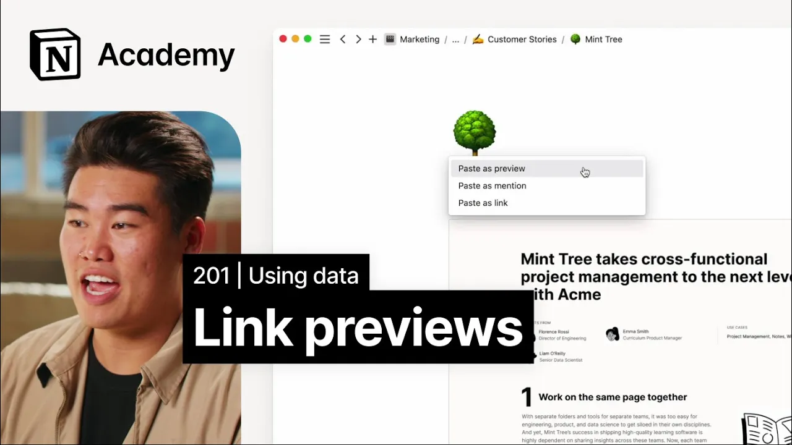

# Create link previews with data from third party tools

**URL:** [https://www.youtube.com/watch?v=gLoX3EDEkKc](https://www.youtube.com/watch?v=gLoX3EDEkKc)
**Date:** 2023-02-14

## Transcript

**[Voiceover]**

"[Music] foreign we'll examine another type of connection in notion link previews and use them to enhance otherwise static documentation in many ways link previews are the Suave and sophisticated older sibling of embeds they're built on top of Notions application programming interface or API this requires authentication and are therefore a more controlled way of bringing data into your notion"

"workspace all slack and most GitHub content you have wouldn't be public on the web so this is a great way to bring in those tools you use often when the information needs to stay secure in addition link previews update more regularly and without any prompt from the user whereas embeds often require you to refresh the page to see"

"the latest and greatest there are dozens of connections with link previews available in notion some of our favorites include slack jira figma Dropbox GitHub OneDrive and data tools like grid and amplitude setting up link previews in notion is just like setting up embeds when you paste a URL from an external app that has a link preview option you'll"

"be prompted with options including paste as mentioned or paste as preview let's talk about these link mentions will look like any other page in notion you'll see the name of the external file but not much else clicking on it would take the user away from notion and to the third party site this is great when you need to"

"include a doc or a file as more of a footnote and not the center piece of your page the second option previews are the bread and butter of this notion feature pasting data like this allows you to see Source information right inside notion the end result of this is similar to an embed what's different is that the first"

"time you paste a link from a new site you'll be prompted to authorize it authenticating an app in notion means that you give notion permission to access data in your account unlike embeds that means that you can paste link previews of things that are not public on the web and are instead private to you or your team importantly"

"once you've authenticated content to be shared in notion anyone with access to that notion page can view the preview for this reason workspace owners have the ability to universally turn off connection access in their settings menu for better management and control of their team's content and data back to the fun stuff use previews to give your readers a"

"view of the content itself like in the case of something visual use mentions when that detail isn't needed like multiple figma files in a row you can view a list of all link preview options at notion.so connections and we're adding more all the time with that let's return to our landing page redesign project plan and add some link"

"previews to further enhance this project plan as the single source of Truth for all landing page happenings in the overview section we can provide additional context by creating a link preview for the kickoff message from Slack this lets people reading this doc easily navigate to slack in order to view any conversations about the project if any edits are"

"made to the slack message that would be reflected in this notion link preview as well similarly I could add a link preview to the kickoff meeting Zoom link or a link preview to a recording in Zoom The Next Step section is a great place for link previews specifically connecting notion to external project management tools let's say for example"

"that one team is using Asana and another team is using GitHub we can display updates from both external Tools in notion no more app switching required to create this link preview we'll simply paste in this link from Asana select paste as preview and there you have it we can do the same with GitHub issues and tasks the GitHub"

"preview will display the name of the task its status and the last PR submitted this is a great way for non-technical folks to keep up with their technical counterparts without having to create a new GitHub account and navigate an unfamiliar platform that's it for now look at how much more valuable and Polished this dock is compared to when"

"we first started That's The Power of connecting tools through notion [Music]"

