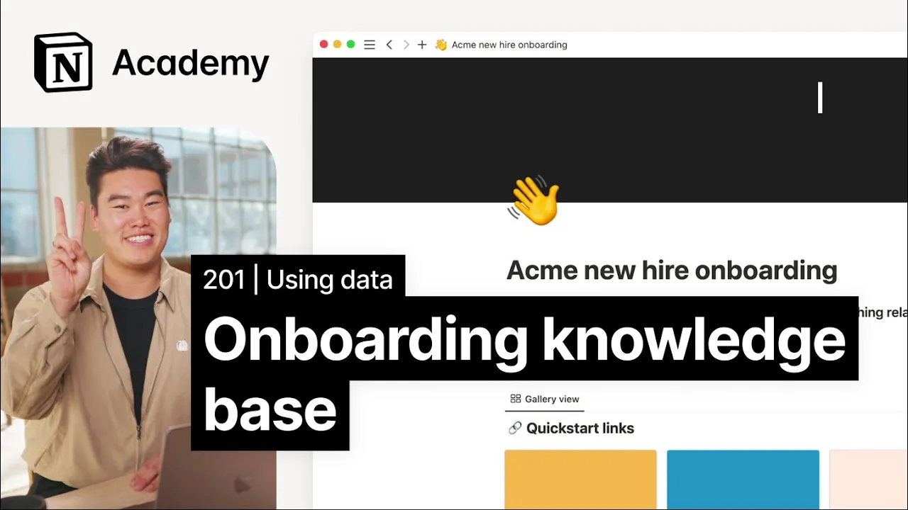

# How to build a knowledge base that incorporates all of your team's tools

**URL:** [https://www.youtube.com/watch?v=fRwkt3lAnmo](https://www.youtube.com/watch?v=fRwkt3lAnmo)
**Date:** 2023-02-14

## Transcript

**[Voiceover]**

"foreign so what's the best way to get new hires up to speed quickly in this project you've been tasked with creating a One-Stop shop for all new hire information by the end of this video we'll create a manual with useful content for every new teammate in your entire company it'll pull important information from all the tools that your"

"team is using into one place we're going to model today's project after figma's fig manual figma uses this as a One-Stop resource for company information and policies rather than building from scratch I'll start by duplicating this template from the gallery into my workspace like so after we duplicate this template we'll find in our workspace this gallery view of"

"the most important Pages for new hires to look at values PTO benefits Etc below that there are additional Wiki pages with other relevant information of course the goal of our project today isn't to build out this Wiki framework instead we'll focus on bringing in information from relevant external apps so let's go to a version of this template that"

"I've already edited a bit I've added some information relevant to Acme Inc but I've saved the best for now with some embeds and Link previews that will create live starting by adding to this values page it currently houses the Acme values as well as a short description about each to enhance it we may choose to embed this Loom"

"video in this video our founder talks about core values that drive our company culture we'll copy the link from Loom and select embed Loom when prompted in notion we could improve our brand guidelines too by adding link previews from Dropbox right click on the file you want to share and click copy link paste the copy Dropbox URL into"

"a new Block in notion and select create embed when prompted the preview of your asset should appear within seconds if you change the asset in Dropbox it would update here as well this ensures that everyone has access to current branding materials at all times the options for what you can do with embeds and Link previews are pretty much"

"endless when you see me again we'll dig into the final layer of connectivity and notion with database syncs and automation see you soon [Music]"

