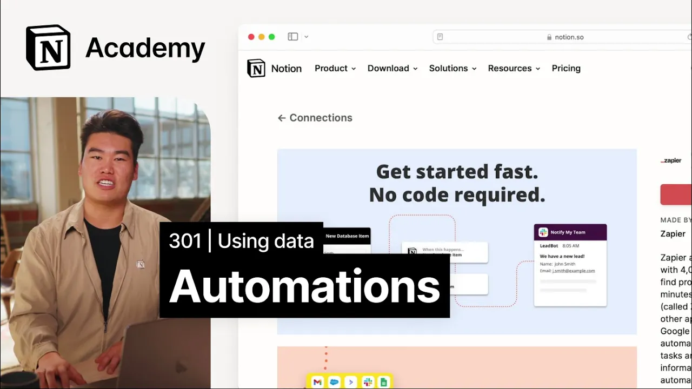

# Build automated workflows between Notion and third party apps

**URL:** [https://www.youtube.com/watch?v=NfISZEoeQC8](https://www.youtube.com/watch?v=NfISZEoeQC8)
**Date:** 2023-02-15

## Transcript

**[Voiceover]**

"foreign we'll install and use connections by creating a form that auto populates a notion database we talked about viewing external data in notion but what about actually making changes to other apps Notions API makes it such that updates in notion databases can trigger actions in other apps thanks to integrator tools like zapier and make you can set up"

"automations to connect your apps without any coding required let's look at just a few examples of what's possible when a task is created add a ticket in jira when a Content request is updated send a message to a slack Channel when an update is marked published send an email to your team's alias create a task list that sends"

"you a notification when you need to start working on the task so how do you go about setting up these time saving automations the kind of software automation I'm describing can largely be summarized with if then statements if this thing happens in one app then this other thing should happen we call this first thing a trigger event and"

"the second one an action most automations in notion work off of updates to database Pages whether that's creating a new page in a database or updating a property which is what we'll look at today for starters let's look at a constructed example of Automation and notion that connects our CX teams tasks database in notion to the engineering team's"

"Jiro board unlike database sync which simply lets you view related information side by side this kind of automation can actually trigger updates to the jira side it takes a little bit longer to set up but depending on your use case can be very valuable this particular automation runs through zapier a powerful integrator that lets you build automated workflows"

"called saps here the trigger is a page being created in the task database in notion once that happens the automated action is to create a new task in jira each detail associated with the notion task is mapped to a corresponding field in jira the name of the task becomes the name of the ticket the assignee gets migrated and"

"any body texts in the notion page becomes details on the jiroticket now let's build our own simple automation we're going to connect typeform to notion to automate the intake process for reference customers that our sales team can use to start we need to make sure zapier is an approved connection you can do this by checking with your administrator"

"or if you're a workspace owner checking the settings and members menu then we'll create our database and form I'm actually going to use this template from notion's template Gallery as my database but you of course could start from scratch and add or remove properties as needed for your team when building the type form we'll want to be mindful"

"of how the questions we're asking will map back to this notion database we essentially want one typeform question for every property in the notion database so to match the notion database we have we'll edit the type form to collect the company name create a checklist of content types that they'd be willing to participate in and also contain a"

"company size function industry and location questions foreign we'll configure this so that when a submission is made to the type form it adds an entry to the notion database check out zapier's help center for more on this process and for troubleshooting finally watch the magic happen once you've completed these steps you'll be able to use typeform to collect"

"and store data quickly and easily alongside the rest of your data in notion I'll leave you with a tip for automations in general anytime you find yourself doing something repeatedly on a time-specific basis or if you're copying and pasting words or if you're thinking oh this is such a pain there's probably an opportunity to automate it happy building"

"[Music]"

