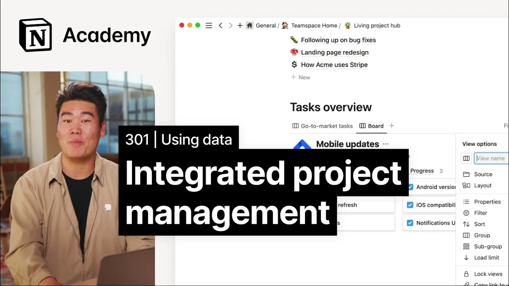

# How to build a connected project management hub

**URL:** [https://www.youtube.com/watch?v=oppnTjKSvHE](https://www.youtube.com/watch?v=oppnTjKSvHE)
**Date:** 2023-02-15

## Transcript

**[Voiceover]**

"foreign for this video we are going to put on our project manager hats and make a living project Hub For an upcoming product launch in this case a new mobile app the goal of this project is to create a single page where anyone who is working on the launch can come and get the latest information about what's going"

"on with other teams go to market teams can get a high level sense of where engineering is at and vice versa at the end of this project we'll be creating a living project Hub that looks something like this our Hub is going to have four main sections we'll have a project overview kickoff notes a docs and meeting database"

"and a task overview this looks pretty simple at first glance but under the hood this setup packs in a ton of valuable information each of these database blocks is pulling data from different sources so that our teams can work in their preferred tools whether that be notion jira GitHub or anywhere else but you as a project manager can"

"keep track of everything in one place to get started let's first create an outline of our four main sections using headings so project overview kickoff notes docs and meetings tasks overview for our first section project overview let's paste in a synced block from the engineering team's initial product requirement document since it's a synced block anytime the overview changes"

"in the PRD it will be updated here in our project Hub as well for the second section kickoff notes I'm just going to go ahead and paste in a slack message as a preview this accomplishes two things it tells anyone coming to this page where they can go to find the latest information on Slack and also gives the"

"context that people need right away here in this notion document now the fun part of this is going to be compiling our last two sections starting with docs and meetings let's say there's a dock about an upcoming mobile feature and a recent meeting called mobile launch timeline changes with this next section viewers can see both of them in"

"one place so to build this section we're going to use a link database block with two different data sources docs and meetings first let's add the linked database and choose our docs database as a source we'll name this view Docs we'll filter this view to just show docs that are relevant to this project I'll go ahead and accomplish"

"that using the filters here to show just the engineering documents so now we have our relevant docs let's add meetings for our second view of this section we're going to choose a new data source the meetings database and name it meetings next just like we did with the docs view we'll filter this with meetings that are related to"

"this project specifically look at this docs and meetings section anyone can come in here and quickly tab through the docs and meeting notes and get an overview of what's going on for the last section tasks we're going to do more or less the same thing as the docs and meetings section but instead of pulling from just notion our"

"second view is going to pull from a sync database with jira tasks so we'll start with the simple view which is go to market tasks I'll create a linked database choose our tasks database as the source and then filter for tasks related to this project for engineering tasks view I'm going to pull from the synced database that lives"

"in the engineering home and then add the filters related to this project now remember from our previous lesson that these project relations here can be Auto populated what you'll need to do is include notion links in the jira ticket description which is something you can configure on the jira end so now we've got our tasks section with two"

"different views we could of course set up other views here as well like a board with task statuses or a calendar or a timeline and that's really all it is you can embellish this with tons of additional details like messaging for your GTM marketing Partners engineering docs links to GitHub repos and more hopefully this idea gets you closer"

"to a single source of Truth for your team [Music]"

