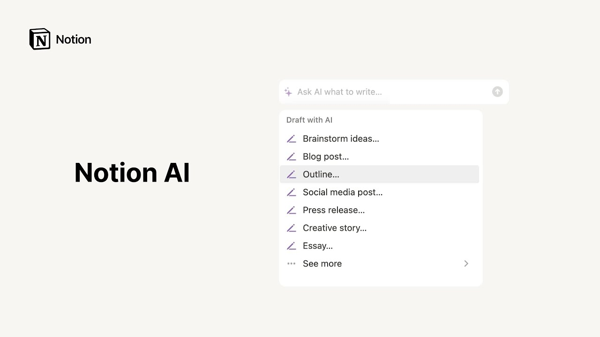

# Notion AI

**URL:** [https://www.youtube.com/watch?v=30yNRO1X7wY](https://www.youtube.com/watch?v=30yNRO1X7wY)
**Date:** 2023-02-27

## Transcript

**[Voiceover]**

"notion AI is a powerful writing assistant that can help you work faster think bigger and augment your creativity in this video we'll explore five different ways you can use these AI features and showcase some examples of each every time you land on a blank page in notion you'll see the option to start writing with AI click on this"

"option to open a dialog box where you can ask notion AI to write anything you can enter any custom prompt here and notion AI will generate text accordingly in the form of paragraphs bullet points numbered lists or even simple tables what's more the drop down menu boasts The Narrative content types to choose from if you're not sure what"

"to ask for try selecting an option here and filling out the rest of the prompt on your own or write your own prompt here we can ask AI to generate a schedule for Acme's next hackathon then simply press enter to send your prompt to Ai and watch the magic happen once your output is generated you can accept the"

"text or keep chatting with AI to refine the output to more closely match what you were hoping for for instance you can ask the AI to display the schedule in a table format note that artificial intelligence and machine learning models will improve over time to better address specific use cases notion AI is the same it may at times"

"output incorrect or misleading information the feature will continue to get better over time moreover AI works best when you already know the information you expect to see on the page in other words the more refined your prompt is the better the outcome in addition to refining AI generated text you can ask notion AI to adapt text that exists"

"within your notion workspace this is useful for expanding on messy notes asking for synonyms translating words and so much more to access notion AI in this way simply highlight a section and click ask AI within the formatting menu once again you'll be greeted with options for editing your text or are free to enter your own custom prompt for"

"example you might select a list of bullet points you've drafted about a job description and ask notion AI to reformat into a paragraph describing what the team is looking for similarly you might select a hastily written paragraph and choose to approve writing change the tone of the content or translate to another language the same action works on smaller"

"bits of text too try highlighting a word or phrase to generate synonyms or ask AI to say the same thing in another way finally when you've completed any documented notion consider selecting all of the text and using the fixed spelling and grammar prompt to ensure that every Doc is polished and presentable if you want to access AI on"

"a new line in notion all you'll need to do is press the space key on your keyboard this will pull up the same now familiar menu with a list of AI prompts these prompts include options like brainstorm ideas to generate additional points or topics to cover make shorter to condense what has already been written or continue writing to"

"reach the existing text by selecting one of these prompts AI seamlessly and intuitively drops into the middle of the document adding new machine generated text that preserves the key ideas and overall flow and coherence of the writing a special category of blocks in notion AI blocks allow you to extract helpful insights from the context of the page you're"

"working on what's more these blocks can be included within buttons and database templates to encourage teammates to make use of time saving AI capabilities let's consider the example of a sales meeting notes database template perhaps every template has a meeting agenda that is filled out by the salesperson in a discovery call with the help of notion AI you"

"can add an action items block as well as a summary block that will be able to pull out key insights from anyone's messy notes so that future readers of these notes won't have to dig through bullet points to find the next steps finally with the keyboard shortcut command J you can access notion AI as quickly as you can"

"think up a prompt at the end of the day no matter how or where you choose to use notion AI in your workspace we hope you'll find that it can act as a powerful thought generator in your day-to-day work enjoy [Music]"

